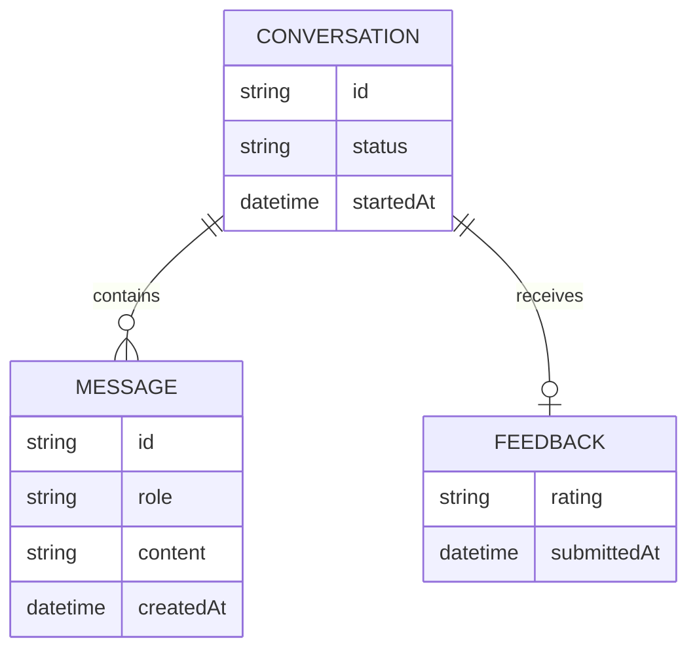
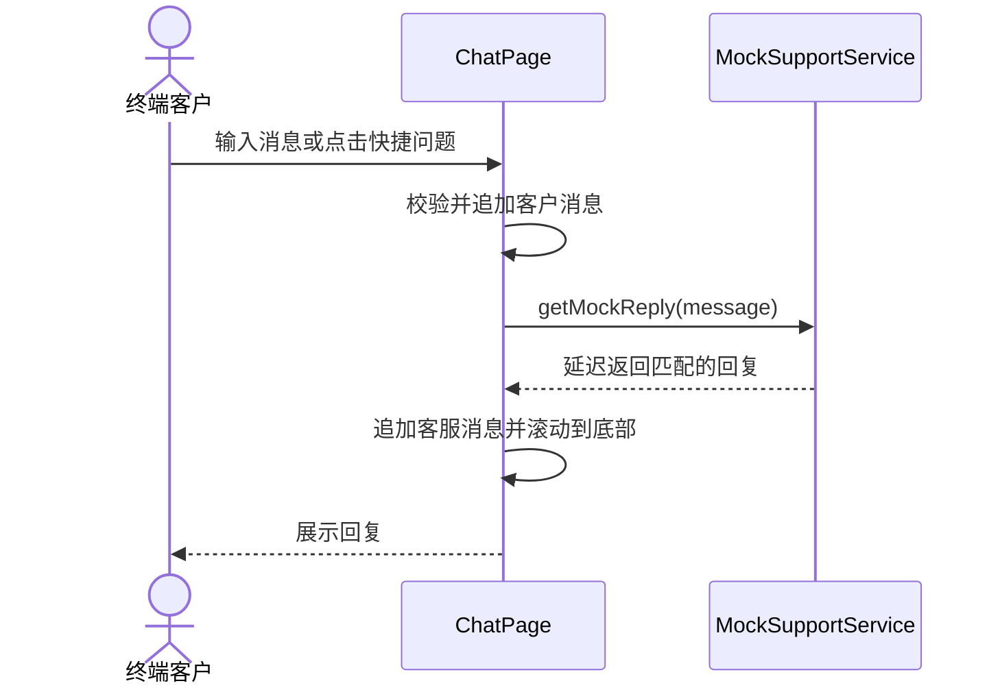
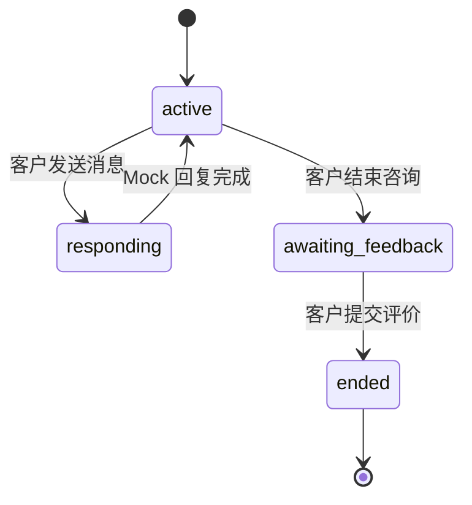

# Customer App 技术设计

## 目标

为终端客户提供一个无需登录即可体验的单会话在线客服页面。当前版本只使用前端 Mock 数据，重点展示咨询、快捷提问、客服回复和会话评价的完整闭环。

## 用例清单

### 发起咨询

```gherkin
Given 客户已打开客服页面
When 客户输入非空消息并发送
Then 页面立即显示客户消息
And 输入框被清空
And 页面展示客服正在输入状态
And Mock 延迟结束后展示客服回复
```

### 使用快捷问题

```gherkin
Given 页面展示快捷问题
When 客户点击一个快捷问题
Then 系统将该问题作为客户消息发送
And Mock 客服返回与问题匹配的回复
```

### 阻止空消息

```gherkin
Given 输入框仅包含空白字符
When 客户尝试发送消息
Then 发送按钮保持禁用
And 会话内容不发生变化
```

### 结束并评价会话

```gherkin
Given 会话处于进行中
When 客户点击结束咨询
Then 会话进入待评价状态
When 客户选择满意或不满意
Then 会话进入已结束状态
And 页面展示评价结果
And 输入区域不再接受消息
```

## 模块边界

### 输入

- 客户输入的文本消息
- 客户点击的快捷问题
- 客户提交的满意度评价

### 输出

- 客户与 Mock 客服的消息时间线
- 客服输入状态
- 会话状态及评价结果

### 不改范围

- 不接入登录、用户身份或权限系统
- 不调用 `customer-svc`、`customer-agent` 或其他真实后端 API
- 不实现多会话、订单详情、附件上传和人工坐席工作台
- 不持久化聊天记录，页面刷新后恢复初始 Mock 状态

## 核心对象



## 数据流



## 会话状态机



## 前端接口

当前阶段不存在网络 API。页面依赖以下显式 Mock 接口：

```ts
type MockSupportService = {
  getReply(message: string): Promise<string>
}
```

- `message` 必须为去除首尾空白后的非空字符串，否则立即抛出异常。
- 回复规则集中定义在 Mock 服务中，未知问题返回统一兜底文案。
- 后续接入真实服务时，可替换该接口实现，不改变页面组件的数据结构。

## 技术决策

- 使用 React + TypeScript + Vite。
- 使用 Tailwind CSS v4，并通过 Vite 插件集成。
- UI 基础组件采用 shadcn/ui 的本地源码模式，图标使用 Lucide React。
- 页面采用移动端优先布局；桌面端展示居中的客服窗口和辅助服务信息。
- 所有时间、消息、快捷问题与回复规则均来自前端 Mock 模块。
