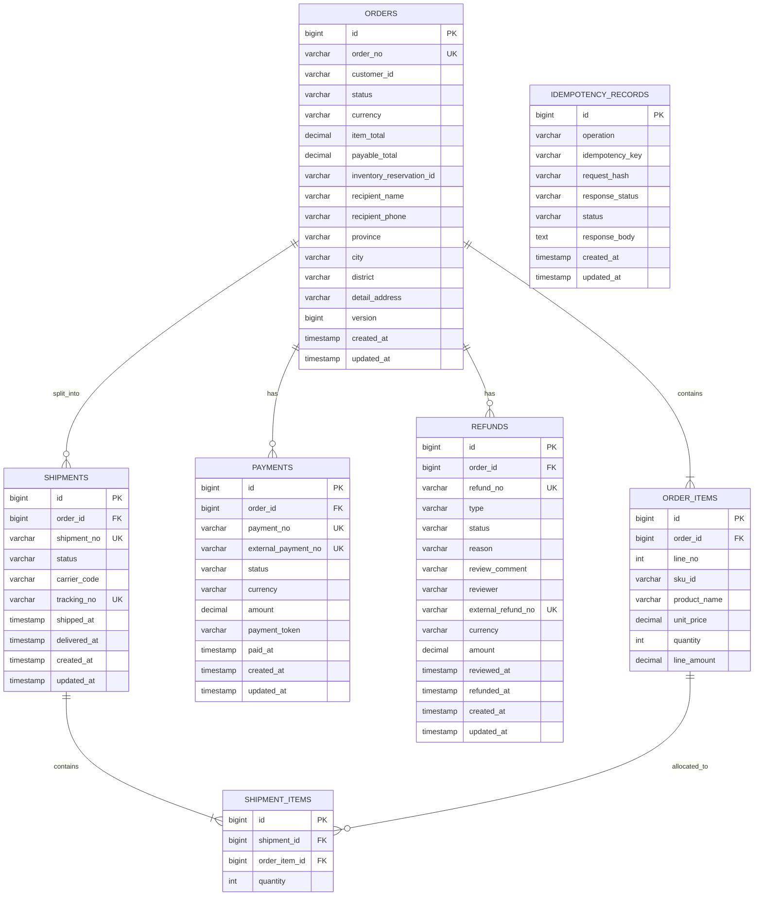
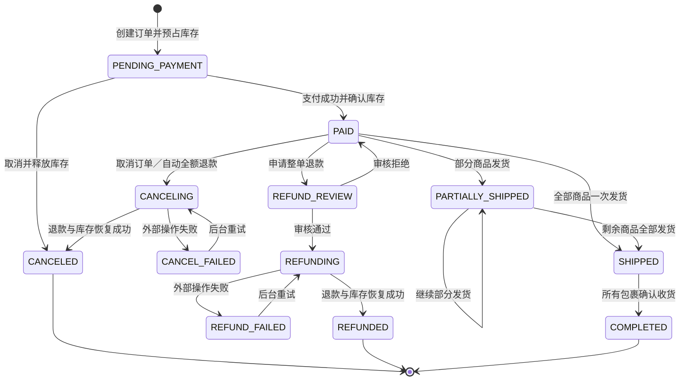
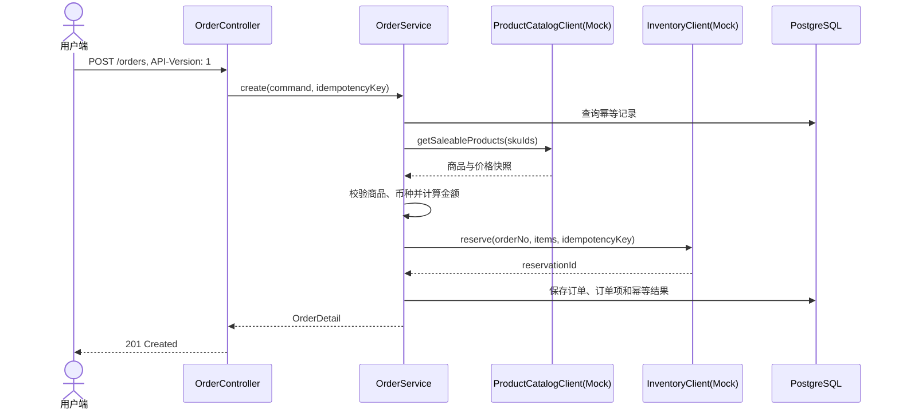
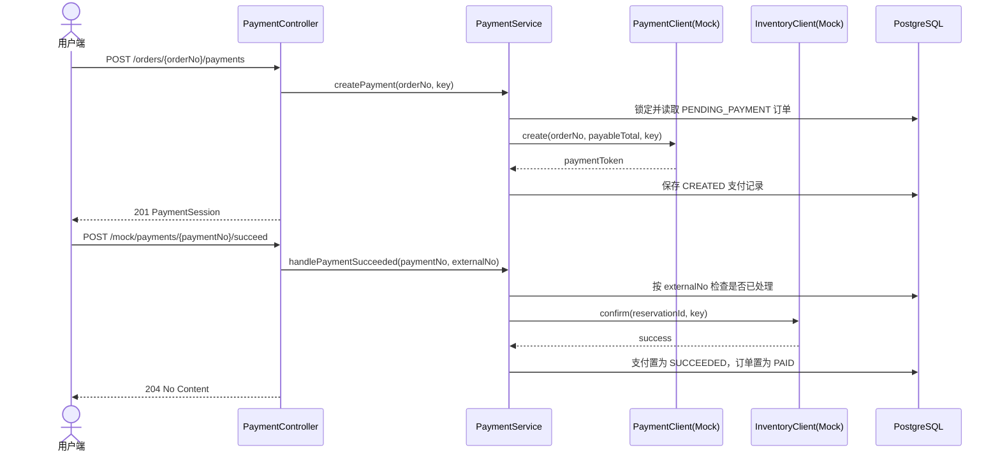
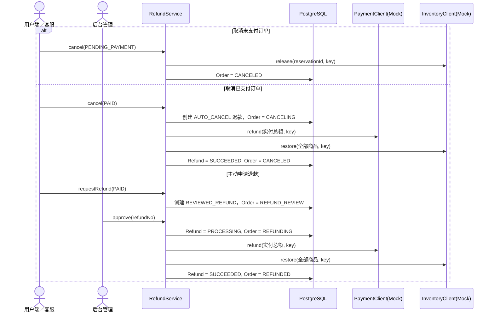
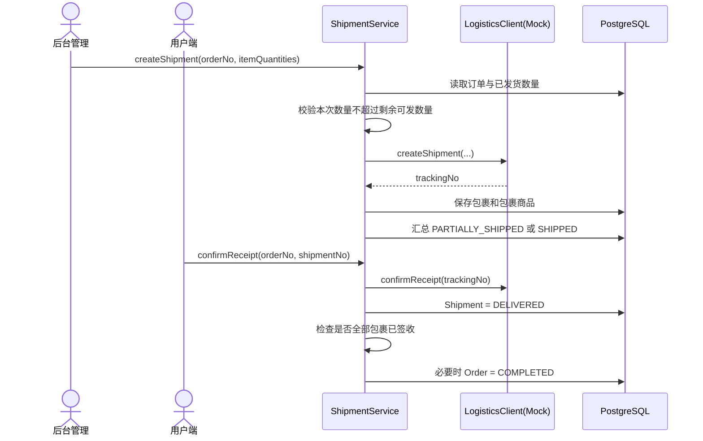

# 订单管理模块技术设计

## 1. 文档信息

- 模块：`order-svc`
- 日期：2026-08-28
- 状态：已确认
- 目标：为电商实体商品提供演示级订单管理能力
- 技术基础：Spring Boot、Spring MVC、Spring Data JPA、Flyway、PostgreSQL

## 2. 已确认的业务决策

1. 一个订单可以包含多个实体商品。
2. 支持创建、支付、拆分发货、确认收货、取消和退款。
3. 拆单仅表示一个订单拆成多个物流包裹，不生成子订单，始终保留一个订单号。
4. 商品、价格、库存、支付和物流均为外部能力；当前不存在真实服务，由 `order-svc` 提供 Mock 适配器。
5. 未支付订单可以直接取消；已支付且未发货订单取消时自动发起整单全额退款。
6. 只要任一包裹已经发货，整单均禁止取消和退款。
7. 不支持部分退款，也不允许调用方指定任意退款金额。
8. 用户主动申请整单退款需要后台审核；取消订单触发的自动退款不需要审核。
9. 不实现租户隔离、登录鉴权和操作权限。本约束仅适用于演示环境。

## 3. 目标与非目标

### 3.1 目标

- 展示完整且可验证的订单生命周期。
- 明确区分交易订单、支付、退款和物流包裹的状态。
- 通过稳定端口隔离外部商品、库存、支付和物流能力。
- 使用 Mock 适配器演示成功、失败、重试和幂等场景。
- 为用户端、客服系统和后台管理提供 REST API。

### 3.2 非目标

- 不实现商品、库存、支付或物流服务的真实业务逻辑。
- 不实现优惠券、促销、税费、运费计算和跨币种结算。
- 不实现部分退款、部分取消、换货或退货物流。
- 不生成子订单，不支持订单合并。
- 不实现身份认证、权限校验和租户隔离。
- 不实现生产级消息总线、分布式事务和财务对账。

## 4. 用例清单

### UC-01 创建订单成功

```gherkin
Given 用户提交合法的商品、数量和收货地址
And 商品 Mock 返回有效商品与价格
And 库存 Mock 成功预占全部商品库存
When 用户创建订单
Then 系统保存订单、商品快照、价格快照和地址快照
And 订单状态为 PENDING_PAYMENT
And 系统返回唯一订单号与应付总额
```

### UC-02 创建订单时商品无效

```gherkin
Given 用户提交不存在或已下架的商品
When 用户创建订单
Then 系统返回 PRODUCT_NOT_AVAILABLE
And 不创建订单
And 不调用库存预占
```

### UC-03 创建订单时库存不足

```gherkin
Given 商品与价格有效
And 至少一个商品库存不足
When 用户创建订单
Then 系统返回 INSUFFICIENT_INVENTORY
And 不创建订单
And Mock 库存中不存在残留预占
```

### UC-04 发起支付并支付成功

```gherkin
Given 订单状态为 PENDING_PAYMENT
When 用户发起支付
Then 系统创建支付记录并返回 Mock 支付凭证

When Mock 支付成功结果到达
Then 系统确认库存扣减
And 支付记录状态为 SUCCEEDED
And 订单状态为 PAID
```

### UC-05 重复支付通知

```gherkin
Given 同一外部支付流水已经处理成功
When 系统再次收到相同支付流水的成功通知
Then 系统返回成功
And 不重复确认库存
And 不重复修改订单
```

### UC-06 取消未支付订单

```gherkin
Given 订单状态为 PENDING_PAYMENT
When 用户或客服取消订单
Then 系统释放库存预占
And 订单状态为 CANCELED
And 不创建退款记录
```

### UC-07 取消已支付未发货订单

```gherkin
Given 订单状态为 PAID
And 订单没有已发货包裹
When 用户或客服取消订单
Then 系统创建无需审核的全额退款记录
And 调用支付 Mock 执行全额退款
And 恢复全部商品库存
And 退款成功后订单状态为 CANCELED
```

### UC-08 申请整单退款

```gherkin
Given 订单状态为 PAID
And 订单没有已发货包裹
When 用户或客服申请退款
Then 系统创建金额等于订单实付金额的退款申请
And 退款状态为 PENDING_REVIEW
And 订单状态为 REFUND_REVIEW
```

### UC-09 审核通过退款

```gherkin
Given 订单状态为 REFUND_REVIEW
And 退款申请状态为 PENDING_REVIEW
When 后台审核通过
Then 系统调用支付 Mock 执行整单全额退款
And 恢复全部商品库存
And 退款成功后订单状态为 REFUNDED
```

### UC-10 审核拒绝退款

```gherkin
Given 订单状态为 REFUND_REVIEW
And 退款申请状态为 PENDING_REVIEW
When 后台填写理由并拒绝退款
Then 退款申请状态为 REJECTED
And 订单状态恢复为 PAID
```

### UC-11 拆分发货

```gherkin
Given 订单状态为 PAID 或 PARTIALLY_SHIPPED
And 本次包裹中的商品数量未超过尚未发货数量
When 后台创建物流包裹
Then 系统调用物流 Mock 创建物流单
And 保存包裹、运单号和包裹商品明细
And 尚有商品未发货时订单状态为 PARTIALLY_SHIPPED
And 全部商品均已发货时订单状态为 SHIPPED
```

### UC-12 确认收货

```gherkin
Given 指定包裹状态为 SHIPPED
When 用户确认该包裹收货
Then 包裹状态为 DELIVERED
And 仍有未签收包裹时订单状态保持 SHIPPED
And 所有包裹均已签收时订单状态为 COMPLETED
```

### UC-13 发货后禁止取消或退款

```gherkin
Given 订单状态为 PARTIALLY_SHIPPED、SHIPPED 或 COMPLETED
When 任意调用方尝试取消订单或申请退款
Then 系统返回 ORDER_NOT_REFUNDABLE
And 不创建取消或退款记录
```

### UC-14 外部调用失败

```gherkin
Given Mock 外部能力被配置为本次调用失败
When 订单服务执行依赖该能力的命令
Then 系统返回明确的外部依赖错误
And 不伪造成功结果
And 对已产生外部副作用的流程记录失败状态并允许使用同一幂等键重试
```

## 5. 模块边界

### 5.1 调用方

| 调用方 | 使用能力 |
| --- | --- |
| 用户端 | 创建和查询订单、发起支付、取消、申请退款、确认收货 |
| 客服系统 | 查询订单、代用户取消、代用户申请退款 |
| 后台管理 | 查询订单、审核退款、创建物流包裹、重试失败退款 |

由于本期不实现鉴权，API 不根据调用方限制操作。调用方名称只用于说明使用场景，不代表安全边界。

### 5.2 输入

- 客户标识。
- 商品 SKU 与购买数量。
- 收货地址。
- 订单号、取消原因和退款原因。
- 退款审核结果与审核意见。
- 发货商品明细、承运商代码。
- 支付 Mock 的成功或失败操作。

### 5.3 输出

- 订单详情和订单列表。
- 订单、支付、退款和包裹状态。
- Mock 支付凭证、运单号。
- 可机器识别的错误码与错误详情。

### 5.4 依赖端口

```java
interface ProductCatalogClient {
    List<ProductSnapshot> getSaleableProducts(Set<String> skuIds);
}

interface InventoryClient {
    InventoryReservation reserve(String orderNo, List<InventoryItem> items, String idempotencyKey);
    void confirm(String reservationId, String idempotencyKey);
    void release(String reservationId, String idempotencyKey);
    void restore(String orderNo, List<InventoryItem> items, String idempotencyKey);
}

interface PaymentClient {
    PaymentSession create(String orderNo, Money amount, String idempotencyKey);
    ExternalRefund refund(String paymentNo, Money amount, String idempotencyKey);
}

interface LogisticsClient {
    LogisticsShipment createShipment(
        String orderNo,
        String shipmentNo,
        String carrierCode,
        AddressSnapshot address,
        List<ShipmentItemCommand> items,
        String idempotencyKey
    );

    void confirmReceipt(String trackingNo, String idempotencyKey);
}
```

### 5.5 不改的范围

- 不修改 `customer-svc`、`customer-agent` 和 `rag-svc` 的职责。
- 不在订单数据库中维护商品主数据或可售库存。
- 不把 Mock API 解释为未来真实外部 API；真实适配器必须单独实现并配置启用。

## 6. 领域模型

### 6.1 聚合划分

- `Order`：聚合根，负责订单项、金额、交易状态及状态迁移规则。
- `Payment`：记录一次支付会话及外部支付流水。
- `Refund`：记录取消自动退款或人工审核退款。
- `Shipment`：一个物流包裹，包含本包裹的商品数量和物流状态。

订单状态是交易与整体履约的汇总状态；包裹状态是独立物流状态。订单不生成子订单。

### 6.2 核心值对象

```java
record Money(BigDecimal amount, String currency) {
    Money {
        requireNonNull(amount);
        requireNonBlank(currency);
        if (amount.scale() > 2 || amount.signum() < 0) {
            throw new InvalidMoneyException(amount, currency);
        }
    }
}

record AddressSnapshot(
    String recipientName,
    String recipientPhone,
    String province,
    String city,
    String district,
    String detailAddress
) {}
```

所有金额都来自商品价格快照并由服务端计算。请求方不得提交单价、订单总额或退款金额。同一订单的所有商品必须使用相同币种，否则创建订单失败。

### 6.3 ER 图



数据库约束：

- `order_items(order_id, line_no)` 唯一。
- `order_items(order_id, sku_id)` 唯一；创建请求中重复 SKU 直接失败，不隐式合并。
- `shipment_items(shipment_id, order_item_id)` 唯一。
- `idempotency_records(operation, idempotency_key)` 唯一。
- 所有数量必须大于零，所有金额必须大于或等于零。
- 更新 `orders` 时显式校验 `version`，受影响行数不是 `1` 时返回 `ORDER_CONCURRENTLY_MODIFIED`。

## 7. 状态设计

### 7.1 订单状态

| 状态 | 含义 |
| --- | --- |
| `PENDING_PAYMENT` | 已创建并预占库存，等待支付 |
| `PAID` | 已支付且尚未发货 |
| `REFUND_REVIEW` | 整单退款等待后台审核 |
| `REFUNDING` | 审核通过，正在执行退款和库存恢复 |
| `REFUND_FAILED` | 退款外部操作失败，等待后台重试 |
| `REFUNDED` | 主动退款完成 |
| `CANCELING` | 已支付订单取消，正在自动退款和恢复库存 |
| `CANCEL_FAILED` | 自动退款或库存恢复失败，等待后台重试 |
| `CANCELED` | 订单取消完成 |
| `PARTIALLY_SHIPPED` | 至少一个商品已发货，但仍有商品未发货 |
| `SHIPPED` | 全部商品已经分配至已发货包裹 |
| `COMPLETED` | 所有包裹均已确认收货 |

### 7.2 订单状态机



状态转换必须由领域方法完成，不允许应用层直接赋值：

```java
order.markPaid(payment);
order.requestRefund(refund);
order.rejectRefund(refund);
order.startCancel(refund);
order.allocateShipment(shipment);
order.confirmShipmentDelivered(shipmentNo);
```

任何未在状态机中声明的转换必须抛出领域异常，不能静默忽略。

### 7.3 支付、退款和包裹状态

```text
PaymentStatus = CREATED | SUCCEEDED | FAILED

RefundType = AUTO_CANCEL | REVIEWED_REFUND
RefundStatus = PENDING_REVIEW | APPROVED | REJECTED | PROCESSING | SUCCEEDED | FAILED

ShipmentStatus = SHIPPED | DELIVERED
```

## 8. 核心流程

### 8.1 创建订单



如果库存预占成功但数据库提交失败，应用服务必须使用相同操作幂等键调用 `InventoryClient.release`。释放失败需要记录错误并向调用方返回失败，不得返回已创建订单。

### 8.2 支付



支付成功处理以外部支付流水号幂等。如果确认库存失败，支付记录不能标记成功，系统返回明确错误并允许使用相同流水重试。

### 8.3 取消与退款



支付退款和库存恢复都必须接受幂等键。若其中一个成功、另一个失败，退款记录进入 `FAILED`，订单进入对应失败状态；后台重试时只重放未成功的步骤。

### 8.4 拆分发货与确认收货



## 9. API 设计

API 不使用路径版本号。所有请求必须携带 `API-Version: 1`；缺失或不支持的版本显式失败。所有创建或命令型请求还必须携带 `Idempotency-Key` 请求头；同一键对应不同请求体时返回 `IDEMPOTENCY_KEY_REUSED`。

### 9.1 用户端与客服 API

| 方法 | 路径 | 用途 | 成功响应 |
| --- | --- | --- | --- |
| `POST` | `/orders` | 创建订单 | `201 OrderDetail` |
| `GET` | `/orders/{orderNo}` | 查询订单详情 | `200 OrderDetail` |
| `GET` | `/orders?customerId=&status=&page=&size=` | 查询订单列表 | `200 Page<OrderSummary>` |
| `POST` | `/orders/{orderNo}/payments` | 创建 Mock 支付会话 | `201 PaymentSession` |
| `POST` | `/orders/{orderNo}/cancel` | 取消订单 | `202 OrderDetail` |
| `POST` | `/orders/{orderNo}/refunds` | 申请整单退款 | `202 RefundDetail` |
| `POST` | `/orders/{orderNo}/shipments/{shipmentNo}/confirm-receipt` | 确认包裹收货 | `200 OrderDetail` |

### 9.2 后台管理 API

| 方法 | 路径 | 用途 | 成功响应 |
| --- | --- | --- | --- |
| `POST` | `/admin/orders/{orderNo}/shipments` | 创建一个物流包裹 | `201 ShipmentDetail` |
| `POST` | `/admin/refunds/{refundNo}/approve` | 审核通过退款 | `202 RefundDetail` |
| `POST` | `/admin/refunds/{refundNo}/reject` | 审核拒绝退款 | `200 RefundDetail` |
| `POST` | `/admin/refunds/{refundNo}/retry` | 重试失败退款流程 | `202 RefundDetail` |

### 9.3 演示专用 Mock API

Mock API 仅在 `demo` Profile 下注册；非 `demo` Profile 启动时不得暴露这些 Controller。

| 方法 | 路径 | 用途 |
| --- | --- | --- |
| `POST` | `/mock/payments/{paymentNo}/succeed` | 模拟支付成功通知 |
| `POST` | `/mock/payments/{paymentNo}/fail` | 模拟支付失败 |
| `PUT` | `/mock/products/{skuId}` | 设置商品与价格 |
| `PUT` | `/mock/inventory/{skuId}` | 设置可售库存 |
| `PUT` | `/mock/failures/{capability}` | 设置指定外部能力下一次调用失败 |

### 9.4 主要请求示例

创建订单：

```json
{
  "customerId": "customer-001",
  "items": [
    { "skuId": "sku-001", "quantity": 2 },
    { "skuId": "sku-002", "quantity": 1 }
  ],
  "shippingAddress": {
    "recipientName": "张三",
    "recipientPhone": "13800000000",
    "province": "上海市",
    "city": "上海市",
    "district": "浦东新区",
    "detailAddress": "示例路 100 号"
  }
}
```

创建物流包裹：

```json
{
  "carrierCode": "MOCK_EXPRESS",
  "items": [
    { "orderItemId": 101, "quantity": 1 },
    { "orderItemId": 102, "quantity": 1 }
  ]
}
```

申请退款：

```json
{
  "reason": "不再需要该商品"
}
```

请求中不存在退款金额或退款商品字段；退款金额始终由服务端读取原支付成功金额。

### 9.5 错误响应

使用 `application/problem+json`：

```json
{
  "type": "https://acm.example/problems/order-state-conflict",
  "title": "Order state conflict",
  "status": 409,
  "code": "ORDER_NOT_REFUNDABLE",
  "detail": "Order O202608280001 has already been shipped",
  "traceId": "..."
}
```

主要错误码：

| HTTP | 错误码 | 含义 |
| --- | --- | --- |
| `400` | `INVALID_REQUEST` | 字段、数量或地址不合法 |
| `400` | `DUPLICATE_SKU` | 创建请求包含重复 SKU |
| `404` | `ORDER_NOT_FOUND` | 订单不存在 |
| `404` | `PRODUCT_NOT_AVAILABLE` | 商品不存在或不可售 |
| `409` | `INSUFFICIENT_INVENTORY` | 库存不足 |
| `409` | `ORDER_STATE_CONFLICT` | 当前状态不支持该操作 |
| `409` | `ORDER_NOT_REFUNDABLE` | 已发货或已结束，禁止退款 |
| `409` | `SHIPMENT_QUANTITY_EXCEEDED` | 发货数量超过剩余数量 |
| `409` | `IDEMPOTENCY_KEY_REUSED` | 幂等键对应了不同请求 |
| `409` | `ORDER_CONCURRENTLY_MODIFIED` | 乐观锁冲突 |
| `502` | `EXTERNAL_DEPENDENCY_FAILED` | Mock 外部能力显式失败 |

## 10. 应用结构

包结构以分层为主、能力为辅，与当前实现保持一致（标注「规划」的为后续用例落点）：

```text
org.acm.os
├── interfaces                              # 适配器层（入站 + 出站）
│   └── http                                # 入站 REST 适配器
│       ├── controller                      # OrderController；规划：PaymentController、
│       │                                   # RefundAdminController、ShipmentAdminController、MockController
│       ├── mapper                          # HTTP DTO 与 command/query/领域投影互转（MapStruct）
│       ├── request                         # 入站 DTO 与 Bean Validation 注解
│       ├── response                        # 出站 DTO
│       ├── exception                       # 传输层异常（UnsupportedApiVersionException）
│       └── GlobalExceptionHandler         # 统一 Problem Details 映射
├── application                             # 应用层
│   ├── port                                # 端口：驱动端 in + 被驱动端 out
│   │   ├── in                              # 入站用例端口
│   │   │   ├── OrderUseCase                # 创建/查询订单用例端口（adapter 依赖其抽象）
│   │   │   ├── command                     # CreateOrderCommand 等入站命令
│   │   │   └── query                       # SearchOrderQuery 等入站查询
│   │   └── out                             # 出站端口与端口契约异常 co-locate
│   │       ├── ProductCatalogClient + ProductNotFoundException
│   │       ├── InventoryClient + InsufficientInventoryException
│   │       └── 规划：PaymentClient、LogisticsClient
│   ├── service                             # 应用服务（实现入站端口）
│   │   ├── OrderService                    # 实现 OrderUseCase；create 内部编排幂等 + 订单创建
│   │   └── IdempotencyService              # 幂等守卫：check→reserve→execute→complete
│   ├── idempotency                         # 幂等记录实体与仓储（技术缓存表，非领域概念）
│   │   ├── IdempotencyRecord
│   │   └── IdempotencyRecordRepository
│   └── exception                           # 应用层异常
│       ├── IdempotencyKeyReuseException
│       └── ReservedByConcurrentWriterException
├── domain                                  # 领域层
│   ├── order                               # Order 聚合、OrderRepository 仓储、DuplicateSkuException、
│   │                                       # CurrencyMismatchException
│   ├── payment                              # Payment 聚合（规划）
│   ├── refund                               # Refund 聚合（规划）
│   ├── shipment                             # Shipment 聚合（规划）
│   └── shared                               # 跨域支撑：AuditMetadata、BusinessException 基类、
│                                           # InvalidRequestException
└── infra                                   # 基础设施层（出站适配器 + 配置）
    ├── client                              # ProductCatalogClient 适配器（当前 Mock）、
    │                                       # InventoryClient 适配器（当前 Mock）；规划：Payment、Logistics
    └── AuditingConfig                      # JPA 审计配置
```

依赖方向：

```text
interfaces.http -> application.port.in（用例端口抽象）-> application.service -> domain
application.service -> application.port.out（出站端口抽象）
infra.client -> 实现 application.port.out 端口（依赖倒置）
infra -> domain（JPA 映射，声明式注解，不构成调用依赖）
domain -> 不依赖 interfaces 与 application
```

已确认的妥协：JPA 与 Spring Data 注解直接标注在领域对象上，仓储端口直接继承
`JpaRepository`，不引入独立的持久化 Row 模型；domain 层仍不得依赖 interfaces 与
application。幂等记录（`IdempotencyRecord`）是技术缓存表而非业务领域概念，放在
`application.idempotency`，不放 domain。

## 11. Mock 设计

### 11.1 行为要求

- Mock 商品目录保存 SKU、名称、单价、币种和可售状态。
- Mock 库存显式维护可售、预占和已扣减数量。
- Mock 支付创建不可伪造的本地支付编号，并通过 Mock API 触发成功或失败。
- Mock 退款按幂等键返回同一外部退款编号。
- Mock 物流创建唯一运单号，并记录包裹商品。
- 未配置的 SKU、承运商或失败规则必须抛出明确异常，不使用隐式默认值。

### 11.2 Profile 配置

```yaml
spring:
  profiles:
    active: demo

order:
  adapters:
    product: mock
    inventory: mock
    payment: mock
    logistics: mock
```

每个适配器配置只接受已注册值。配置缺失或值未知时应用启动失败，不自动回退到 Mock。

## 12. 一致性、幂等与失败处理

### 12.1 本地一致性

- 单次状态转换与本地数据写入必须处于同一数据库事务。
- 应用服务读取订单后，通过 `@Version` 防止并发发货、退款或取消。
- 领域校验先于外部调用执行；非法状态不得调用外部服务。

### 12.2 外部调用

- 所有产生副作用的外部端口都必须接收幂等键。
- 支付流水号、退款流水号、运单号均建立唯一约束。
- 外部调用超时或失败必须抛出异常并记录明确失败状态。
- 自动退款和审核退款的失败可由后台 API 重试；重试只执行未成功步骤。
- 不使用“捕获异常后记录日志并返回成功”的静默容错。

### 12.3 并发规则

```text
if optimisticLockConflict:
    reload order
    if same idempotency key already completed:
        return stored response
    else:
        throw ORDER_CONCURRENTLY_MODIFIED
```

## 13. 校验规则

- `customerId`、SKU、收货人、手机号和完整地址不能为空。
- 订单至少包含一个商品，每种商品数量必须大于零。
- 同一请求中 SKU 不得重复。
- 商品服务必须返回全部请求 SKU，且都处于可售状态。
- 所有商品币种必须一致。
- 服务端使用 `unitPrice × quantity` 计算行金额，再汇总订单金额。
- 支付金额与订单应付金额必须完全相等。
- 退款金额必须等于原支付成功金额。
- 同一订单同时最多存在一个未结束退款申请。
- `PAID` 状态才能申请退款或开始发货。
- `REFUND_REVIEW` 状态不能发货，避免审核期间改变可退款条件。
- 任一商品已发货后，订单不能取消或退款。
- 包裹中每个商品的累计发货数量不能超过订单购买数量。
- 只有 `SHIPPED` 包裹才能确认收货；重复确认按幂等成功处理。

## 14. 可观测性

- 记录 `traceId`、`orderNo`、`paymentNo`、`refundNo`、`shipmentNo` 和幂等键。
- 日志不得记录完整手机号或详细地址。
- 核心指标：
  - 创建订单成功与失败次数；
  - 支付成功与失败次数；
  - 退款待审核数量；
  - 退款和取消失败数量；
  - 外部 Mock 调用失败次数；
  - 各状态订单数量。

## 15. 测试策略

### 15.1 领域单元测试

- 覆盖状态机中的全部合法转换。
- 对每个未声明转换验证抛出明确领域异常。
- 覆盖金额计算、拆分发货数量汇总和全额退款约束。
- 覆盖任一包裹发货后禁止取消和退款。

### 15.2 应用服务测试

- 使用内存 Fake 端口验证调用顺序和幂等键传递。
- 覆盖商品不存在、库存不足、支付失败、退款失败和物流失败。
- 覆盖退款成功但库存恢复失败后的安全重试。
- 覆盖并发创建包裹与退款申请的乐观锁冲突。

### 15.3 API 集成测试

- 使用 PostgreSQL 测试容器执行 Flyway 迁移，不以 H2 兼容行为替代关键数据库约束测试。
- 按 UC-01 至 UC-14 编写端到端测试。
- 验证 Problem Details、HTTP 状态码和幂等响应。
- 验证非 `demo` Profile 不暴露 Mock API。

## 16. 实施顺序

1. 增加 Flyway 数据库迁移与 JPA 实体映射。
2. 实现订单、退款与包裹领域模型及状态机单元测试。
3. 定义四个外部端口与显式 Mock 适配器。
4. 实现创建、查询、支付和支付 Mock 流程。
5. 实现取消、退款审核、失败重试流程。
6. 实现拆分发货和逐包裹确认收货。
7. 增加 REST API、统一错误响应和 OpenAPI 文档。
8. 完成 BDD 集成测试、日志脱敏和指标。

## 17. 完成标准

- UC-01 至 UC-14 全部通过自动化测试。
- OpenAPI 中可以完整演示创建、支付、拆分发货、确认收货、取消和退款审核。
- 任一非法状态转换都返回明确错误，不修改数据、不调用无关外部端口。
- 重复命令、支付通知和退款重试不产生重复扣减、重复退款或重复包裹。
- 订单详情能展示商品快照、支付、退款和全部物流包裹。
- 关闭 `demo` Profile 后，Mock API 不可访问，缺失真实适配器时应用启动失败。
