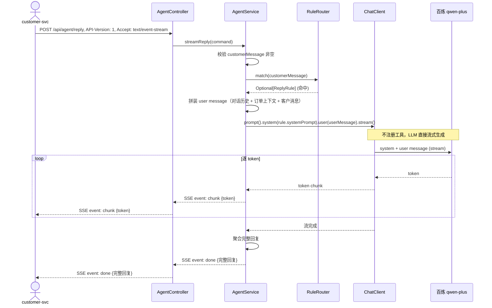
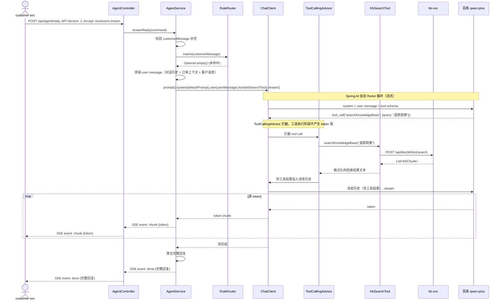

# Customer Agent 模块技术设计

## 1. 文档信息

- 模块：`customer-agent`
- 日期：2026-08-29
- 状态：已取代——`customer-svc` 已并入本模块，见 `2026-08-30-customer-agent-merge.md`；混合范式（§7-§12）继续有效
- 目标：为 `customer-svc` 提供 AI 回复生成能力，采用混合范式（规则路由 + ReAct Tool Calling），覆盖订单上下文回复、知识库 RAG 回复和兜底回复
- 技术基础：Spring Boot 4.1.1、Spring AI 2.0.x（ChatClient + ToolCallingAdvisor + stream）、Spring MVC（SSE 流式响应）、Lombok

## 2. 已确认的业务与技术决策

1. `customer-agent` 是独立 Spring Boot 应用，通过 REST API 被 `customer-svc` 调用。`customer-svc` 的出站端口 `AiAgentClient` 当前由 Mock 适配器实现；`customer-agent` 提供真实实现后，`customer-svc` 新增真实 HTTP 适配器替换 Mock（`customer-svc` 的改动不在本设计范围）。
2. 采用混合范式：规则路由 + ReAct Tool Calling。规则命中走快路径（用规则 system prompt 约束 LLM 生成，不提供工具）；规则未命中走 ReAct 慢路径（LLM 自主决定是否调用 KB 检索工具，基于工具返回结果继续推理再生成回复）。
3. ReAct 循环由 Spring AI 的 `ToolCallingAdvisor` 自动实现：LLM 返回 tool call → advisor 拦截 → `ToolCallingManager` 执行工具 → 结果喂回 LLM → LLM 继续推理或给出 final answer。不需要手动编写循环逻辑。
4. 规则命中后仍调用 LLM 生成回复，规则提供专用 system prompt 约束生成方向。不使用模板直接回复——展示 AI 生成能力。
5. `kbNo`（知识库编号）通过 `customer-agent` 的 `application.yml` 固定配置，不修改 `ReplyRequest` 契约。演示环境只有一个知识库。
6. 规则集存储在 YAML 配置文件中，通过 Spring `@ConfigurationProperties` 绑定。`customer-agent` 无状态、无数据库。对话历史由 `customer-svc` 在 `ReplyRequest.recentMessages` 注入。
7. 规则匹配机制为关键词包含匹配：每条规则定义逗号分隔的关键词列表，客户消息包含任一关键词即命中。按 `priority DESC` 排序，首个命中生效。
8. `customer-agent` 不需要自己的幂等机制。`customer-svc` 幂等守卫已缓存完整响应（客户消息 + agent 回复），同一幂等键重试直接返回缓存，不调用 `customer-agent`。`customer-agent` 保持无状态。
9. LLM 使用百炼 OpenAI 兼容端点，模型为 `qwen-plus`（支持 Function Calling），通过 `spring-ai-starter-model-openai` 接入。百炼 OpenAI 兼容端点原生支持 tool calling，Spring AI 的 `OpenAiChatModel` 直接兼容。
10. KB 检索通过真实 HTTP 适配器调用 `kb-svc` 的 `POST /api/kbs/{kbNo}/search` 端点。不使用 Mock 适配器。
11. 工具调用失败时返回错误信息给 LLM，让 LLM 自主决定回复策略（如告知用户服务暂不可用，或基于已有上下文回答）。符合 agent 自主决策特性。
12. Agent 人设为电商客服助手，默认 system prompt 在 `application.yml` 中配置。
13. 不实现租户隔离、登录鉴权和操作权限。本约束仅适用于演示环境。
14. 回复生成采用 SSE（Server-Sent Events）流式返回。LLM 生成内容逐 token 推送给调用方，减少首字延迟。Spring AI `ChatClient.stream().content()` 返回 `Flux<String>`，在 `AgentService` 内部消费后通过中性的 `ReplyStream` 回调推送；`AgentController` 用 Spring MVC 原生 `SseEmitter` 映射为 `text/event-stream` 响应，不依赖 WebFlux。流式模式下的 ReAct 循环由 `ToolCallingAdvisor` 自动管理——工具调用阶段不产生 token 流，工具执行完成后 LLM 基于 tool result 流式生成最终回复。
15. SSE 事件协议：`event: chunk` + `data: {token文本}` 逐 token 推送；`event: done` + `data: {完整回复}` 标记流结束并返回完整内容；`event: error` + `data: {错误码,详情}` 推送错误。`customer-agent` 只暴露 SSE 端点，不提供同步 JSON 端点。`customer-svc` 的真实 HTTP 适配器消费 SSE 流并聚合为同步 `AgentReply` 返回值，在 `done` 事件时获得完整回复。

## 3. 目标与非目标

### 3.1 目标

- 展示混合范式的完整回复生成链路：规则路由 → 快路径（LLM 约束生成）或 ReAct 慢路径（LLM + Tool Calling 自主推理）。
- 通过规则集保证高频问题（订单状态、退款、发票等）的回复方向确定性，且不跳过 LLM 生成。
- 通过 ReAct + KB 检索工具处理长尾问题，LLM 自主决定是否检索知识库、如何使用检索结果。
- 为 `customer-svc` 提供与 `AiAgentClient` 契约对齐的 REST API。
- 工业级设计：结构化 system prompt 工程、清晰的工具描述、可观测性（日志 + 链路追踪）、可配置性、超时管理。

### 3.2 非目标

- 不实现 Reflection（反思迭代）。当前 ReAct + 规则路由已满足需求。演进路径见 §13。
- 不实现意图识别（LLM 意图分类）。规则集的关键词匹配已满足演示需求。
- 不实现多轮对话记忆。`customer-svc` 在 `ReplyRequest.recentMessages` 注入对话历史，`customer-agent` 无状态。
- 不实现 customer-svc 的真实 HTTP 适配器（`AiAgentClient` 的真实实现）。`customer-svc` 的改动不在本设计范围。
- 不实现向量重排（rerank）和混合检索。
- 不实现身份认证、权限校验和租户隔离。
- 不实现数据库持久化。规则集通过 YAML 配置，agent 无状态。

## 4. 用例清单

### UC-01 规则命中快路径生成回复

```gherkin
Given 客户消息包含某条已启用规则的关键词
When customer-agent 处理回复请求
Then 系统使用该规则的 system prompt 作为 LLM 系统提示
And 系统不注册 KB 检索工具（LLM 无法调用工具）
And 系统将对话历史与订单上下文拼装为用户消息
And 系统调用 LLM 流式生成回复
And 系统通过 SSE 逐 token 推送回复内容
And 系统在流结束时推送完整回复内容
```

### UC-02 规则未命中走 ReAct 路径且 LLM 调用工具

```gherkin
Given 客户消息不包含任何已启用规则的关键词
When customer-agent 处理回复请求
Then 系统使用默认 system prompt
And 系统注册 KB 检索工具
And LLM 自主判断需要检索知识库
And LLM 发出 tool call（传入查询文本）
And Spring AI ToolCallingAdvisor 执行 KB 检索工具
And 工具返回检索到的知识库分块
And LLM 基于检索结果推理后流式生成最终回复
And 系统通过 SSE 逐 token 推送回复内容
And 系统在流结束时推送完整回复内容
```

### UC-03 规则未命中走 ReAct 路径且 LLM 不调用工具

```gherkin
Given 客户消息不包含任何已启用规则的关键词
And 客户问题可从已提供的订单上下文直接回答
When customer-agent 处理回复请求
Then 系统使用默认 system prompt 并注册 KB 检索工具
And LLM 自主判断无需检索知识库
And LLM 基于已有订单上下文直接流式生成回复
And 系统通过 SSE 逐 token 推送回复内容
And 系统在流结束时推送完整回复内容
```

### UC-04 KB 检索工具返回空

```gherkin
Given LLM 调用了 KB 检索工具
And 知识库检索返回空结果
When 工具返回空结果给 LLM
Then LLM 自主处理空检索结果（如基于已有上下文回答或引导联系人工客服）
And 系统通过 SSE 逐 token 推送 LLM 生成的回复内容
And 不抛出异常
```

### UC-05 订单上下文为空

```gherkin
Given recentOrders 为空列表
When customer-agent 处理回复请求
Then 系统在用户消息中标注「（无订单信息）」
And 系统仍调用 LLM 流式生成回复
And 系统通过 SSE 逐 token 推送回复内容
```

### UC-06 LLM 调用失败

```gherkin
Given LLM 服务不可用或返回空内容
When customer-agent 处理回复请求
Then 系统通过 SSE 推送 error 事件（错误码 LLM_UNAVAILABLE）
And 不伪造回复内容
And customer-svc 收到错误后整体回滚
```

### UC-07 KB 检索工具调用失败

```gherkin
Given LLM 调用了 KB 检索工具
And KbSearchClient HTTP 调用失败
When 工具捕获异常
Then 工具返回错误信息给 LLM
And LLM 自主决定回复策略（如告知用户知识库暂不可用，或基于已有上下文回答）
And 系统通过 SSE 逐 token 推送 LLM 生成的回复内容
And 不抛出异常（工具错误由 LLM 自主处理）
```

### UC-08 阻止空客户消息

```gherkin
Given 客户消息为空或仅包含空白字符
When customer-agent 收到回复请求
Then 系统返回 INVALID_REQUEST
And 不调用 LLM
```

## 5. 模块边界

### 5.1 调用方

| 调用方 | 使用能力 |
| --- | --- |
| `customer-svc`（通过真实 HTTP 适配器） | 调用 `POST /api/agent/reply` 流式生成回复（SSE） |

由于本期不实现鉴权，API 不根据调用方限制操作。

### 5.2 输入

- 对话编号（`conversationNo`，仅用于日志追踪）。
- 客户标识（`customerId`，仅用于日志追踪）。
- 近期消息历史（`recentMessages`，角色 + 内容 + 时间）。
- 近期订单摘要（`recentOrders`，订单号 + 状态 + 金额 + 币种 + 时间）。
- 客户消息（`customerMessage`，非空文本）。

### 5.3 输出

- SSE 流：逐 token 推送的 `chunk` 事件、流结束时的 `done` 事件（含完整回复内容）、异常时的 `error` 事件（含错误码与详情）。

### 5.4 依赖端口

```java
// 入站端口（customer-agent 自身定义，REST API 实现）
interface AgentUseCase {
    void streamReply(GenerateReplyCommand command, ReplyStream stream);
}

// 中性流式回调，不绑定 Reactor Flux 或 SseEmitter
interface ReplyStream {
    void emitChunk(String token);
    void emitDone(String fullContent);
    void emitError(String code, String detail);
}

record GenerateReplyCommand(
    String conversationNo,
    String customerId,
    List<MessageContext> recentMessages,
    List<OrderSummary> recentOrders,
    String customerMessage
) {}

record MessageContext(String role, String content, LocalDateTime createdAt) {}

record OrderSummary(
    String orderNo,
    String status,
    BigDecimal payableTotal,
    String currency,
    LocalDateTime createdAt
) {}

// 出站端口：知识库检索（调用 kb-svc HTTP API）
interface KbSearchClient {
    List<KbChunk> search(SearchRequest request);
}

record SearchRequest(String kbNo, String query, int topK) {}

record KbChunk(
    String content,
    double score,
    String documentNo,
    String documentName
) {}
```

`KbSearchClient` 的 HTTP 适配器调用 `kb-svc` 的 `POST /api/kbs/{kbNo}/search` 端点（需携带 `API-Version: 1` 头）。

### 5.5 不改的范围

- 不修改 `customer-svc`、`kb-svc`、`order-svc` 的职责。
- 不修改 `customer-svc` 的 `AiAgentClient` 端口契约（同步 `AgentReply generate(ReplyRequest)`）。`customer-agent` 只暴露 SSE 端点，`customer-svc` 的真实 HTTP 适配器消费 SSE 流并聚合为同步 `AgentReply` 返回值。是否透传 SSE 给前端由 `customer-svc` 自行决定，不在本设计契约范围。真实适配器实现不在本设计范围。
- 不在 `customer-agent` 中维护任何持久化数据。
- 不修改 `kb-svc` 的 API 或端口定义。

## 6. 领域模型

### 6.1 规则模型

`customer-agent` 无数据库、无聚合根。规则是配置驱动的值对象：

```java
record ReplyRule(
    String keywords,       // 逗号分隔的关键词列表
    String systemPrompt,   // 命中时使用的专用 system prompt
    int priority           // 优先级，数值越大越优先
) {}
```

规则匹配逻辑由 `RuleRouter` 在应用层内存完成，启动时从 YAML 配置加载。

### 6.2 规则状态

规则无启停状态——通过 YAML 配置增删规则即等价于启用/停用。无状态机。

## 7. 核心流程

### 7.1 规则命中快路径



### 7.2 规则未命中 ReAct 路径



ReAct 循环可多轮：LLM 可在第一轮工具返回结果后继续调用工具（如换关键词重试），直到 LLM 认为可以给出 final answer。`ToolCallingAdvisor` 自动管理循环终止（LLM 不再返回 tool call 时终止）。工具执行阶段不产生 token 流——只有 LLM 生成最终回复时才流式推送 token。

### 7.3 决策伪代码

```text
function streamReply(command, stream):
    if command.customerMessage is blank:
        throw INVALID_REQUEST
    
    rule = ruleRouter.match(command.customerMessage)
    userMessage = buildUserMessage(command.recentMessages, command.recentOrders, command.customerMessage)
    fullReply = StringBuilder()
    
    if rule.isPresent():
        // 快路径：规则约束，无工具
        chatClient.prompt()
            .system(rule.get().systemPrompt())
            .user(userMessage)
            .stream()
            .content()
            .doOnNext(token -> { fullReply.append(token); stream.emitChunk(token) })
            .doOnComplete(() -> {
                if fullReply.isBlank(): stream.emitError(LLM_UNAVAILABLE, "empty content")
                else: stream.emitDone(fullReply.toString().strip())
            })
            .doOnError(e -> stream.emitError(LLM_UNAVAILABLE, e.message))
            .blockLast()  // 在 controller 线程或异步线程中阻塞至流完成
    else:
        // ReAct 路径：LLM + KB 检索工具，自主推理
        // ToolCallingAdvisor 自动管理 ReAct 循环：工具调用阶段不产生 token，
        // 工具执行完成后 LLM 基于 tool result 流式生成 final answer
        chatClient.prompt()
            .system(defaultSystemPrompt)
            .user(userMessage)
            .tools(kbSearchTool)
            .stream()
            .content()
            .doOnNext(token -> { fullReply.append(token); stream.emitChunk(token) })
            .doOnComplete(() -> {
                if fullReply.isBlank(): stream.emitError(LLM_UNAVAILABLE, "empty content")
                else: stream.emitDone(fullReply.toString().strip())
            })
            .doOnError(e -> stream.emitError(LLM_UNAVAILABLE, e.message))
            .blockLast()

## 8. API 设计

API 不使用路径版本号。所有请求必须携带 `API-Version: 1`；缺失或不支持的版本显式失败。不需要 `Idempotency-Key`——幂等由 `customer-svc` 的幂等守卫保证。

### 8.1 回复生成（SSE 流式）

| 方法 | 路径 | 用途 | 成功响应 |
| --- | --- | --- | --- |
| `POST` | `/api/agent/reply` | 流式生成 AI 回复 | `200 text/event-stream` |

请求必须携带 `Accept: text/event-stream` 头。请求体与之前一致：

```json
{
  "conversationNo": "C202608290001",
  "customerId": "customer-001",
  "recentMessages": [
    { "role": "CUSTOMER", "content": "我的订单什么时候发货？", "createdAt": "2026-08-29T14:30:00" },
    { "role": "AGENT", "content": "您的订单已在今日发货，预计2-3个工作日送达。", "createdAt": "2026-08-29T14:31:00" }
  ],
  "recentOrders": [
    { "orderNo": "ORD-2026-0001", "status": "SHIPPED", "payableTotal": 299.00, "currency": "CNY", "createdAt": "2026-08-28T10:00:00" }
  ],
  "customerMessage": "我的订单到哪了？"
}
```

SSE 事件流示例：

```text
event: chunk
data: 您

event: chunk
data: 最近

event: chunk
data: 的订单

...（逐 token 推送）...

event: chunk
data: 查看实时物流信息。

event: done
data: {"content":"您最近的订单 ORD-2026-0001 当前状态为已发货（SHIPPED），应付金额 299.00 CNY。预计1-3个工作日送达，您可以在订单详情页查看实时物流信息。"}
```

SSE 事件类型：

| 事件 | data 格式 | 说明 |
 | --- | --- | --- |
| `chunk` | `{token}` 纯文本 | LLM 生成的一个文本片段，逐个推送 |
| `done` | `{"content":"完整回复"}` JSON | 流正常结束，包含聚合后的完整回复内容（供 customer-svc 持久化） |
| `error` | `{"code":"LLM_UNAVAILABLE","detail":"..."}` JSON | 流异常终止，包含错误码与详情 |

`done` 事件是流的最后一个事件。`customer-svc` 消费 SSE 流，在收到 `done` 后获得完整回复并结束聚合。

### 8.2 错误处理

请求级错误（如客户消息为空）在 SSE 流建立前返回，使用 `application/problem+json`（与 `customer-svc` / `order-svc` 一致）：

```json
{
  "type": "https://acm.example/problems/invalid-request",
  "title": "Bad Request",
  "status": 400,
  "code": "INVALID_REQUEST",
  "detail": "Customer message must not be blank",
  "traceId": "..."
}
```

流中级错误（如 LLM 超时）通过 SSE `error` 事件推送：

```text
event: error
data: {"code":"LLM_UNAVAILABLE","detail":"LLM service timed out"}
```

主要错误码：

| 场景 | HTTP | 错误码 | 传输方式 |
| --- | --- | --- | --- |
| 客户消息为空 | `400` | `INVALID_REQUEST` | Problem Details JSON（流前） |
| LLM 调用失败/超时 | `200` | `LLM_UNAVAILABLE` | SSE error 事件（流中） |

KB 检索工具失败不产生错误事件——工具错误信息回传 LLM，由 LLM 自主处理后正常流式推送回复。

## 9. 应用结构

包结构以分层为主、能力为辅，与 `order-svc` / `customer-svc` 保持一致。无数据库层：

```text
org.acm.ca
├── interfaces                              # 适配器层
│   └── http
│       ├── controller
│       │   └── AgentController             # POST /api/agent/reply → SseEmitter (text/event-stream)
│       ├── mapper                          # HTTP DTO 与 command/领域投影互转（MapStruct）
│       ├── request                         # 入站 DTO 与 Bean Validation 注解
│       ├── response                        # 出站 DTO
│       ├── exception                       # UnsupportedApiVersionException
│       ├── ApiVersionInterceptor           # API-Version 头校验
│       └── GlobalExceptionHandler          # 统一 Problem Details 映射
├── application                             # 应用层
│   ├── port
│   │   ├── in
│   │   │   ├── AgentUseCase                # streamReply(command, ReplyStream)
│   │   │   └── command                     # GenerateReplyCommand
│   │   └── out
│   │       ├── KbSearchClient              # 出站检索端口（HTTP 调 kb-svc）
│   │       └── KbSearchUnavailableException
│   ├── service
│   │   └── AgentService                    # 实现 AgentUseCase；编排规则路由 + agent 流式生成
│   ├── rule
│   │   ├── ReplyRule                       # 规则值对象（keywords, systemPrompt, priority）
│   │   ├── ReplyRulesConfig                # @ConfigurationProperties 绑定 YAML
│   │   └── RuleRouter                      # 关键词包含匹配
│   └── exception                           # 应用层异常
│       └── LlmUnavailableException
├── domain                                  # 领域层
│   └── shared
│       ├── BusinessException               # 基类（自持副本）
│       └── InvalidRequestException
└── infra                                   # 基础设施层
    ├── llm
    │   ├── ChatClientConfig                # ChatClient bean（default system prompt）
    │   └── KbSearchTool                    # @Tool 注解，调用 KbSearchClient
    ├── observability
    │   └── ToolCallObservingAdvisor        # 观测 ReAct 循环每一轮迭代（StreamAdvisor/CallAdvisor）
    └── client
        └── KbSearchClientImpl              # HTTP 适配器（RestClient 调 kb-svc）
```

依赖方向：

```text
interfaces.http -> application.port.in -> application.service -> domain
application.service -> application.port.out（出站端口抽象）
application.service -> infra.llm.KbSearchTool（通过 ChatClient.tools() 注入）
infra.llm.KbSearchTool -> application.port.out.KbSearchClient（调用出站端口）
infra.client.KbSearchClientImpl -> 实现 application.port.out 端口（依赖倒置）
domain -> 不依赖 interfaces 与 application
```

`BusinessException` 和 `GlobalExceptionHandler` 在 `customer-agent` 本模块内自持一份（包名 `org.acm.ca`），与 `order-svc` 的 `org.acm.os` 和 `customer-svc` 的 `org.acm.cs` 副本平行。`common-lib` 当前只承载 HTTP 传输 DTO，本期不改该约定。

## 10. 技术决策

### 10.1 Spring AI 集成

通过 `spring-ai-starter-model-openai` 接入百炼 OpenAI 兼容端点。不引入 `spring-ai-alibaba`（版本不兼容 Boot 4.x）。不引入 `spring-ai-starter-vector-store-pgvector`（向量检索是 `kb-svc` 的职责）。

BOM 版本：`org.springframework.ai:spring-ai-bom:2.0.1`。

百炼配置：

```yaml
spring:
  ai:
    openai:
      api-key: ${DASHSCOPE_API_KEY}
      base-url: https://dashscope.aliyuncs.com/compatible-mode/v1
      chat:
        model: qwen-plus
        options:
          temperature: 0.7
```

百炼 qwen-plus 支持 Function Calling（已确认：百炼 OpenAI 兼容端点原生支持 tool calling，qwen-plus 在百炼文档的 Function Calling 支持模型列表中）。

### 10.2 ChatClient 配置

```java
@Configuration
class ChatClientConfig {
    @Bean
    ChatClient chatClient(ChatClient.Builder builder) {
        return builder
            .defaultSystem(defaultSystemPrompt)
            .build();
    }
}
```

默认 system prompt 从 `application.yml` 的 `customer.agent.default-system-prompt` 读取。`ChatClient.Builder` 由 `spring-ai-starter-model-openai` 自动配置注入。

### 10.3 KbSearchTool 设计

Kb 检索工具是 Spring AI `@Tool` 注解的方法，被 `ToolCallingAdvisor` 在 ReAct 循环中自动调用：

```java
@Component
public class KbSearchTool {

    private final KbSearchClient kbSearchClient;
    private final String kbNo;
    private final int topK;

    public KbSearchTool(
            KbSearchClient kbSearchClient,
            @Value("${customer.agent.kb-no}") String kbNo,
            @Value("${customer.agent.kb-top-k:5}") int topK) {
        this.kbSearchClient = kbSearchClient;
        this.kbNo = kbNo;
        this.topK = topK;
    }

    @Tool(description = "搜索知识库获取相关文档内容。当客户询问退款政策、退货规则、发票申请、发货时间、平台规则等需要查阅知识库的问题时使用此工具。对于订单状态查询等可从已有订单信息直接回答的问题，无需使用此工具。")
    public String searchKnowledgeBase(
            @ToolParam(description = "搜索查询文本，应为客户问题的关键词或核心内容") String query) {
        try {
            List<KbChunk> chunks = kbSearchClient.search(
                new SearchRequest(kbNo, query, topK));
            if (chunks.isEmpty()) {
                return "未找到与查询相关的知识库内容。";
            }
            return chunks.stream()
                .map(c -> "- " + c.content() + "（来源：" + c.documentName() + "）")
                .collect(Collectors.joining("\n"));
        } catch (Exception e) {
            return "知识库检索失败：" + e.getMessage() + "。请基于已有信息回答或建议客户稍后重试。";
        }
    }
}
```

工具设计要点：

- `@Tool` 的 `description` 是 LLM 决策是否调用工具的关键依据。明确描述工具用途和适用场景，让 LLM 准确判断何时需要检索知识库。
- `@ToolParam` 的 `description` 引导 LLM 生成正确的工具参数。
- 工具失败时返回结构化错误信息给 LLM，让 LLM 自主决定回复策略（agent 范式核心特性）。
- 工具返回值是人类可读的文本格式（不是 JSON），便于 LLM 理解和使用。

### 10.4 KbSearchClient HTTP 适配器

```java
@Component
public class KbSearchClientImpl implements KbSearchClient {

    private final RestClient restClient;

    public KbSearchClientImpl(
            @Value("${customer.agent.kb-service.base-url}") String baseUrl) {
        this.restClient = RestClient.builder()
            .baseUrl(baseUrl)
            .defaultHeader("API-Version", "1")
            .build();
    }

    @Override
    public List<KbChunk> search(SearchRequest request) {
        KbSearchResponse response = restClient.post()
            .uri("/api/kbs/{kbNo}/search", request.kbNo())
            .body(new KbSearchRequest(request.query(), request.topK()))
            .retrieve()
            .body(KbSearchResponse.class);
        if (response == null || response.chunks() == null) {
            return List.of();
        }
        return response.chunks().stream()
            .map(c -> new KbChunk(c.content(), c.score(), c.documentNo(), c.documentName()))
            .toList();
    }
}
```

调用 `kb-svc` 的 `POST /api/kbs/{kbNo}/search` 端点，携带 `API-Version: 1` 头。HTTP 超时由 `RestClient` 配置，默认 10 秒。

### 10.5 LLM Prompt 结构

#### 默认 system prompt（ReAct 路径）

```
你是一个友好专业的电商平台客服助手。你的职责是根据提供的对话历史、订单信息和知识库内容，准确回答客户的问题。

你拥有以下工具：
- searchKnowledgeBase：搜索知识库获取相关文档内容

回复要求：
1. 回复要简洁、准确、有礼貌
2. 对于订单状态、物流等可从已提供订单信息回答的问题，直接回答
3. 对于退款政策、退货规则、发票申请等需要查阅知识库的问题，使用 searchKnowledgeBase 工具获取信息后回答
4. 如果工具返回错误或无结果，基于已有信息回答或引导客户联系人工客服
5. 不要编造不确定的信息
```

默认 system prompt 在 `application.yml` 中配置（`customer.agent.default-system-prompt`）。

#### 规则 system prompt 示例（订单状态查询）

```
客户询问订单状态或物流信息。根据提供的订单信息，告知客户最新订单的订单号、状态和应付金额。如果订单已发货，告知预计送达时间。回复要简洁明了。
```

#### User message 拼装

快路径和 ReAct 路径使用相同的 user message 格式：

```
## 对话历史
[客户] 14:30: 我的订单什么时候发货？
[客服] 14:31: 您的订单已在今日发货，预计2-3个工作日送达。

## 订单信息
- 订单号: ORD-2026-0001 | 状态: SHIPPED | 金额: 299.00 CNY

## 客户消息
我的订单到哪了？
```

拼装规则：

- 对话历史段：`recentMessages` 为空时省略该段。
- 订单信息段：`recentOrders` 为空时标注「（无订单信息）」。
- 客户消息段：始终输出。

### 10.6 规则匹配算法

```java
@Component
public class RuleRouter {

    private final List<ReplyRule> rules;

    public RuleRouter(ReplyRulesConfig config) {
        this.rules = config.rules().stream()
            .sorted(Comparator.comparingInt(ReplyRule::priority).reversed())
            .toList();
    }

    public Optional<ReplyRule> match(String customerMessage) {
        for (ReplyRule rule : rules) {
            for (String keyword : rule.keywords().split(",")) {
                String trimmed = keyword.strip();
                if (!trimmed.isEmpty() && customerMessage.contains(trimmed)) {
                    return Optional.of(rule);
                }
            }
        }
        return Optional.empty();
    }
}
```

规则在启动时加载并排序，运行时全量内存匹配。规则数量预期 < 100 条，性能无忧。

### 10.7 规则集 YAML 配置

```yaml
customer:
  agent:
    default-system-prompt: |
      你是一个友好专业的电商平台客服助手。你的职责是根据提供的对话历史、订单信息和知识库内容，准确回答客户的问题。
      你拥有以下工具：
      - searchKnowledgeBase：搜索知识库获取相关文档内容
      回复要求：
      1. 回复要简洁、准确、有礼貌
      2. 对于订单状态、物流等可从已提供订单信息回答的问题，直接回答
      3. 对于退款政策、退货规则、发票申请等需要查阅知识库的问题，使用 searchKnowledgeBase 工具获取信息后回答
      4. 如果工具返回错误或无结果，基于已有信息回答或引导客户联系人工客服
      5. 不要编造不确定的信息
    kb-no: KB-2026-0001
    kb-top-k: 5
    kb-service:
      base-url: http://localhost:8001
    rules:
      - keywords: "订单,物流,快递,发货,到哪了,运单"
        system-prompt: |
          客户询问订单状态或物流信息。根据提供的订单信息，告知客户最新订单的订单号、状态和应付金额。如果订单已发货，告知预计送达时间。回复要简洁明了。
        priority: 10
      - keywords: "退款,退货,退钱"
        system-prompt: |
          客户询问退款或退货相关事宜。根据提供的订单信息判断订单状态，引导客户在订单详情页提交退款或退货申请。退款审核通过后将原路退回。回复要简洁明了。
        priority: 8
      - keywords: "发票"
        system-prompt: |
          客户询问发票相关事宜。告知客户电子发票会在订单完成后24小时内发送至注册邮箱，可在订单详情页下载。回复要简洁明了。
        priority: 8
      - keywords: "人工,客服,坐席"
        system-prompt: |
          客户要求转接人工客服。告知客户已记录转接需求，将尽快安排人工客服跟进。回复要礼貌并安抚客户情绪。
        priority: 5
```

`ReplyRulesConfig` 通过 `@ConfigurationProperties(prefix = "customer.agent")` 绑定。

### 10.8 超时管理

LLM 调用超时通过 Spring AI 底层 HTTP 客户端配置，默认 30 秒。超时视为 `LLM_UNAVAILABLE`。

KB 检索 HTTP 超时通过 `RestClient` 配置，默认 10 秒。超时由工具捕获后返回错误信息给 LLM。

```yaml
spring:
  ai:
    openai:
      chat:
        options:
          temperature: 0.7
```

### 10.9 build.gradle 变更

移除 JPA、Flyway、PostgreSQL 依赖（无数据库）。新增 Spring AI 依赖与可观测性依赖（§12）：

```gradle
plugins {
    id 'java'
    id 'jacoco'
    id 'org.springframework.boot'
    id 'io.spring.dependency-management'
}

description = 'customer-agent'

dependencies {
    implementation project(':common-lib')
    implementation 'org.springframework.boot:spring-boot-micrometer-tracing-brave'
    implementation 'org.springframework.boot:spring-boot-starter-actuator'
    implementation 'org.springframework.boot:spring-boot-starter-webmvc'
    implementation 'io.micrometer:micrometer-registry-prometheus'
    implementation 'io.micrometer:micrometer-tracing-bridge-brave'
    implementation 'org.springdoc:springdoc-openapi-starter-webmvc-ui:3.1.0'
    implementation 'org.mapstruct:mapstruct:1.6.3'
    implementation platform('org.springframework.ai:spring-ai-bom:2.0.1')
    implementation 'org.springframework.ai:spring-ai-starter-model-openai'
    compileOnly 'org.projectlombok:lombok'
    developmentOnly 'org.springframework.boot:spring-boot-devtools'
    annotationProcessor 'org.projectlombok:lombok'
    annotationProcessor 'org.springframework.boot:spring-boot-configuration-processor'
    annotationProcessor 'org.mapstruct:mapstruct-processor:1.6.3'
    testImplementation 'org.springframework.boot:spring-boot-micrometer-tracing-test'
    testImplementation 'org.springframework.boot:spring-boot-starter-webmvc-test'
    testCompileOnly 'org.projectlombok:lombok'
    testRuntimeOnly 'org.junit.platform:junit-platform-launcher'
    testAnnotationProcessor 'org.projectlombok:lombok'
}
```

覆盖率要求：domain + application 层行覆盖率 ≥ 0.85，分支覆盖率 ≥ 0.75。无 `integrationTest` sourceSet（无数据库集成测试）。

### 10.10 application.yml

```yaml
spring:
  application:
    name: customer-agent
  ai:
    openai:
      api-key: ${DASHSCOPE_API_KEY}
      base-url: https://dashscope.aliyuncs.com/compatible-mode/v1
      chat:
        model: qwen-plus
        options:
          temperature: 0.7

server:
  port: 8010

management:
  endpoints:
    web:
      exposure:
        include: health,prometheus

customer:
  agent:
    default-system-prompt: |
      你是一个友好专业的电商平台客服助手...
    kb-no: KB-2026-0001
    kb-top-k: 5
    kb-service:
      base-url: http://localhost:8001
    rules:
      - keywords: "订单,物流,快递,发货,到哪了,运单"
        system-prompt: |
          客户询问订单状态或物流信息...
        priority: 10
      # ... 其余规则见 §10.7
```

### 10.11 SSE 流式响应

Spring MVC 原生 `SseEmitter` 实现 SSE，不依赖 WebFlux / Reactor。`AgentController` 创建 `SseEmitter`，将其适配为 `ReplyStream` 回调传给 `AgentService`：

```java
@RestController
class AgentController {
    @PostMapping(value = "/api/agent/reply", produces = MediaType.TEXT_EVENT_STREAM_VALUE)
    SseEmitter reply(@RequestBody @Valid AgentReplyRequest request) {
        SseEmitter emitter = new SseEmitter(30_000L); // 超时 30s
        executor.execute(() -> {
            try {
                var command = mapper.toCommand(request);
                var stream = new SseReplyStream(emitter);
                agentUseCase.streamReply(command, stream);
            } catch (BusinessException e) {
                emitter.completeWithError(e);
            }
        });
        return emitter;
    }
}

// SseEmitter → ReplyStream 适配
class SseReplyStream implements ReplyStream {
    private final SseEmitter emitter;

    void emitChunk(String token) {
        emitter.send(SseEmitter.event().name("chunk").data(token));
    }
    void emitDone(String fullContent) {
        emitter.send(SseEmitter.event().name("done")
            .data(Map.of("content", fullContent)));
        emitter.complete();
    }
    void emitError(String code, String detail) {
        emitter.send(SseEmitter.event().name("error")
            .data(Map.of("code", code, "detail", detail)));
        emitter.complete();
    }
}
```

`AgentService` 内部通过 `ChatClient.stream().content()` 获取 token 流（infra 层 Spring AI 使用 Reactor `Flux`），通过 `doOnNext` 回调 `stream.emitChunk`、`doOnComplete` 回调 `stream.emitDone`、`doOnError` 回调 `stream.emitError`，最后 `blockLast()` 阻塞至流完成。Reactor `Flux` 封装在 `AgentService` 内部，不泄漏到应用端口或 controller 层。

关键设计点：
- 应用端口 `AgentUseCase` 和 `ReplyStream` 不依赖 Reactor / SSE 类型，保持传输中立。
- `SseEmitter` 适配在 controller 层（interfaces），是传输细节，不泄漏到 application 层。
- `ChatClient.stream()` 返回的 `Flux<String>` 封装在 `AgentService` 内部，是 infra 层 Spring AI 的实现细节。

## 11. 一致性与失败处理

### 11.1 失败场景汇总

| 场景 | 行为 | 错误码 | 传输方式 |
| --- | --- | --- | --- |
| 客户消息为空 | 不调用 LLM | `400 INVALID_REQUEST` | Problem Details JSON（流前） |
| LLM 调用超时 | 推送 error 事件 | `LLM_UNAVAILABLE` | SSE error 事件（流中） |
| LLM 返回空内容 | 推送 error 事件 | `LLM_UNAVAILABLE` | SSE error 事件（流中） |
| KB 检索 HTTP 失败 | 工具捕获异常，返回错误信息给 LLM，LLM 自主处理 | 不产生 error 事件 | 不抛异常 |
| KB 检索返回空 | 工具返回「未找到相关知识库内容」，LLM 自主处理 | 不产生 error 事件 | 不抛异常 |
| 规则集为空（YAML 无规则） | 所有消息走 ReAct 路径 | 不产生 error 事件 | 不抛异常 |

### 11.2 设计原则

- **fail-fast（请求级）**：客户消息为空在 SSE 流建立前返回 400，不进入流。
- **error 事件（流中级）**：LLM 失败（超时、空内容）通过 SSE `error` 事件推送，不伪造回复。`customer-svc` 收到 error 事件后整体回滚。
- **agent 自主性**：工具调用失败不产生 error 事件，返回错误信息给 LLM。LLM 自主决定回复策略——这是 agent 范式的核心特性，区别于硬编码的 if-else 流程。
- **无静默容错**：不使用「捕获异常后记录日志并返回成功」的静默容错。

## 12. 可观测性

LLM 可观测性 = 3 类信号（Metrics / Tracing / Logging）× 3 层覆盖（Agent 编排层 / LLM 调用层 / 工具层）。

Spring AI 对 `ChatClient` / `ChatModel` 自动产生 observation，`customer-agent` 只需补「agent 专属信号」和「导出后端」。当前项目 4 个服务均声明 `micrometer-tracing-brave` 但没有 exporter 和 Prometheus registry——trace 与 metric 产生即丢弃。工业级实现必须补齐采集与导出。完整链路：

```text
Spring AI observation → Micrometer 采集 → 导出后端
      （内置）            （未引入）          （未引入）
```

### 12.1 LLM 调用层 — Spring AI 内置，只配开关

Spring AI 对 `ChatClient` 自动产生 observation（[官方文档](https://docs.spring.io/spring-ai/reference/observability/index.html)）：

- **Metric（自动）**：`gen_ai.chat.client.operation`（duration timer：sum/count/max/active_count）、token 用量（input/output/total counter）。
- **低基数 key 进 metric + trace**：`operation` / `system` / `model`。
- **高基数 key 只进 trace**：token 详情、prompt/completion 内容。

prompt / completion 默认**不导出**（大、敏感），按需开日志：

```yaml
spring:
  ai:
    chat:
      client:
        observations:
          log-prompt: false      # 默认 false，含敏感信息，谨慎开启
          log-completion: false
```

⚠️ Spring AI 2.0 行为变更：**内容观测已从 tracing 改为 logging**——`include-prompt` 改名 `log-prompt`，prompt/completion 内容只进日志、不进 trace span。设计禁止把 prompt/completion 塞回 span。

### 12.2 Agent 编排层 — 自定义 Observation，Spring AI 不覆盖

规则路由命中、路径（快路径/ReAct）、ReAct 迭代次数、首 token 延迟（TTFT）、完整回复延迟是 `customer-agent` 独有信号，用 Micrometer `Observation` 包裹 `AgentService.streamReply`：

```java
@Service
public class AgentService implements AgentUseCase {

    private final ObservationRegistry observationRegistry;

    @Override
    public void streamReply(GenerateReplyCommand command, ReplyStream stream) {
        Observation observation = Observation.createNotStarted("agent.reply", observationRegistry)
            .lowCardinalityKeyValue("path", "unknown")              // 快速/ReAct，低基数
            .lowCardinalityKeyValue("rule.matched", "false")        // 低基数
            .start();
        try (Scope scope = observation.openScope()) {
            ReplyRule rule = ruleRouter.match(command.customerMessage()).orElse(null);
            observation.lowCardinalityKeyValue("rule.matched", rule != null ? "true" : "false");
            observation.lowCardinalityKeyValue("path", rule != null ? "fast" : "react");
            if (rule != null) {
                observation.lowCardinalityKeyValue("rule.no", rule.ruleNo()); // 规则编号有限，低基数
            }
            observation.highCardinalityKeyValue("conversation_no", command.conversationNo()); // 高基数，只进 trace
            // ... 流式生成，聚合 token 数、TTFT、完整回复延迟
            observation.stop();
        } catch (Exception e) {
            observation.error(e);
            observation.stop();
            throw e;
        }
    }
}
```

规则命中 / 路径是**低基数**（有限枚举，进 metric 才有聚合价值）；`conversationNo` 是**高基数**（只进 trace）。

### 12.3 工具调用层 — 自定义 Advisor 观测 ReAct 循环

Spring AI 官方定制点（[recursive advisor 文档](https://docs.spring.io/spring-ai/reference/api/advisors-recursive.html)）：`CallAdvisor` / `StreamAdvisor` 拦截**每一轮** tool-call 迭代，order 设 `HIGHEST_PRECEDENCE + 400`（在 `ToolCallingAdvisor` 的 300 之后）。ReAct 循环的关键信号只有这里能拿到：

```java
public class ToolCallObservingAdvisor implements StreamAdvisor, CallAdvisor {

    private final MeterRegistry meterRegistry;

    @Override
    public Flux<ChatClientResponse> aroundStream(ChatClientRequest request, StreamAdvisorChain chain) {
        return chain.nextStream(request).doOnNext(this::observeIteration);
    }

    private void observeIteration(ChatClientResponse response) {
        if (response.chatResponse().hasToolCalls()) {
            response.chatResponse().getToolCalls().forEach(tc -> {
                meterRegistry.counter("agent.tool.calls",
                    "name", tc.name(), "status", "requested").increment();
                log.info("tool call requested: name={} args={}", tc.name(), tc.arguments());
            });
        } else {
            meterRegistry.counter("agent.react.iterations", "outcome", "final").increment();
        }
    }

    @Override
    public int getOrder() {
        return Ordered.HIGHEST_PRECEDENCE + 400;
    }
}
```

注册到 `ChatClient`：

```java
@Bean
ChatClient chatClient(ChatClient.Builder builder, ToolCallObservingAdvisor advisor) {
    return builder
        .defaultAdvisors(advisor)       // 观测 advisor 与 ToolCallingAdvisor 并列
        .defaultSystem(defaultSystemPrompt)
        .build();
}
```

### 12.4 token 用量 — 流式下从 done 事件补

`ChatResponse.getMetadata().getUsage()` 提供 `PromptTokens` / `CompletionTokens` / `TotalTokens`（[usage-handling 文档](https://docs.spring.io/spring-ai/reference/api/usage-handling.html)），但流式下 `Usage` 在流结束才完整。`AgentService` 聚合完整回复后，把 token 数塞进 `done` 事件，随完整回复一起暴露，供 `customer-svc` 持久化成本数据：

```java
record AgentReplyDone(String content, long promptTokens, long completionTokens, long totalTokens) {}
```

### 12.5 落地分层

| 层 | 演示期（本期） | 工业级演进 |
| --- | --- | --- |
| Metric 采集 | `spring-boot-starter-actuator` + `micrometer-registry-prometheus` | 同左，接入 Grafana 告警 |
| Trace 导出 | 日志打印 traceId（`traceId` 已在 problem+json 暴露） | OTel Collector → Tempo/Loki 或托管平台 |
| 指标后端 | 仅 `/actuator/prometheus` 裸暴露 | Prometheus + Grafana |
| LLM 平台观测 | 自定义 advisor 日志 + Micrometer | 可选 Langfuse/LangSmith（OpenLLMetry 导出，Spring AI 通用后端不选型） |

本期不引入 Langfuse/LangSmith——它们通过自行拦截 HTTP 或 SDK 拿 prompt/completion 全量，与 Spring AI 的 Micrometer 体系平行双轨、接入成本高。工业级正确路径：先把 `gen_ai.*` metric + span 打通（Prometheus + OTel），Agent 层信号用 Micrometer `Observation` 与内置信号共用同一 registry 与导出链路，prompt/completion 内容走日志。

## 13. 演进路径

混合范式的设计为未来演进预留了清晰路径：

1. **引入 Reflection**：在 LLM 生成后增加反思层（Critique → Refine），仅在 ReAct 路径启用，保证快路径零延迟。`ToolCallingAdvisor` 之后插入 `ReflectionAdvisor`（自定义 Advisor）。
2. **引入意图识别**：将关键词匹配替换为 LLM 意图分类，规则集结构不变（意图 → system prompt 映射）。增加一个 `IntentClassificationTool` 或独立的轻量 LLM 调用。
3. **增加更多工具**：在 ReAct 路径注册更多工具（如 `queryOrderStatus` 直接调 order-svc、`getShippingInfo` 调物流 API），让 LLM 自主选择工具组合。只需新增 `@Tool` 方法并注册到 `.tools()`。
4. **真实 customer-svc 适配器**：在 `customer-svc` 中新增 `AiAgentClient` 的真实 HTTP 适配器，消费 `customer-agent` 的 `POST /api/agent/reply`（SSE）流并聚合为同步 `AgentReply` 返回值。`customer-agent` API 不变。前端若需流式体验，`customer-svc` 后续可透传 SSE 至前端，属其独立演进。
以上 1-4 是**范式演进**——局部替换验证当前混合范式结构。下面是**工业级工程支撑补缺**，是「上线才出事、demo 看不出来」的能力，按离工业级的距离排序：

5. **回复护栏（Guardrails）**：输入 prompt 注入过滤、输出 PII 脱敏与越界检测。作为独立 `GuardrailAdvisor` 落在 ChatClient advisor 链（order 高于 `ToolCallingAdvisor`）。
6. **成本 / 步数硬上限**：`ToolCallingAdvisor` 配置最大推理迭代次数（防 self-loop）；单请求 token 预算与成本上限；超限即终止并推 error 事件。
7. **回复质量评测**：golden 问题集 + 忠实度/相关性回归，复用 `kb-svc` 的 `Evaluator` 抽象（`FactCheckingEvaluator` / `RelevancyEvaluator`）。改 system prompt 或规则集后跑回归。
8. **LLM 网关**：熔断、限流、配额池——架构图 `LLM Gateway` 职责，当前仓库空白。引入后 `ChatClient` 与 `KbSearchClient` 的调用均经网关。
9. **工具权限 + 沙箱**：引入有副作用工具（退款、改单）时，工具分级 + 人工审批 + 幂等；架构图 `LLM Sandbox` 职责。

其中 5、6、7 是「离工业级最近的一公里」：护栏、成本上限、评测。演示级交付不含 5-9；目标是演示闭环，这些作为能力起点写入本路径。
