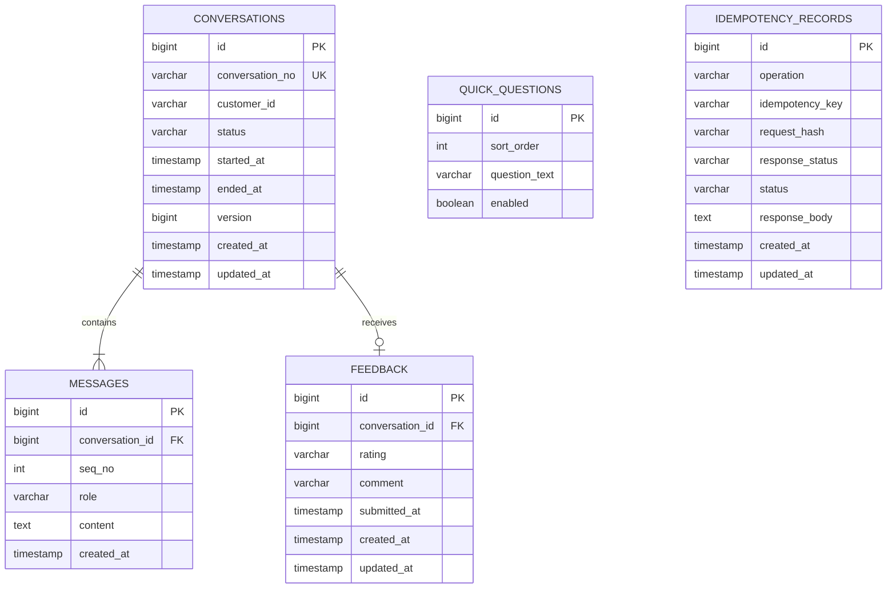
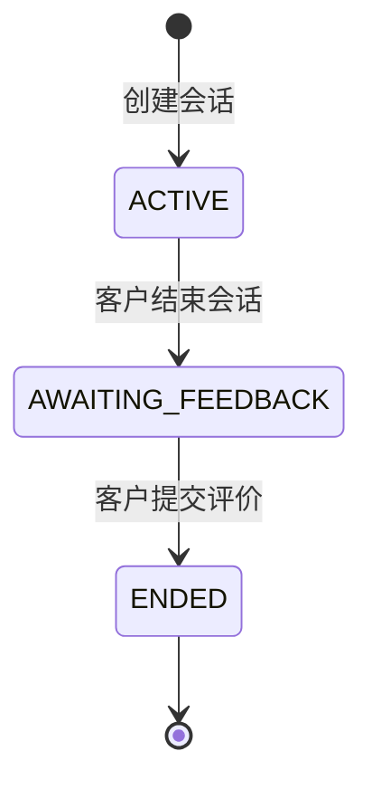
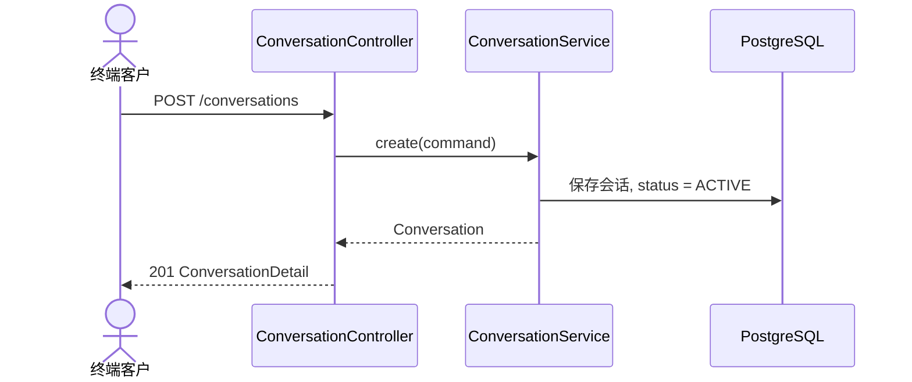
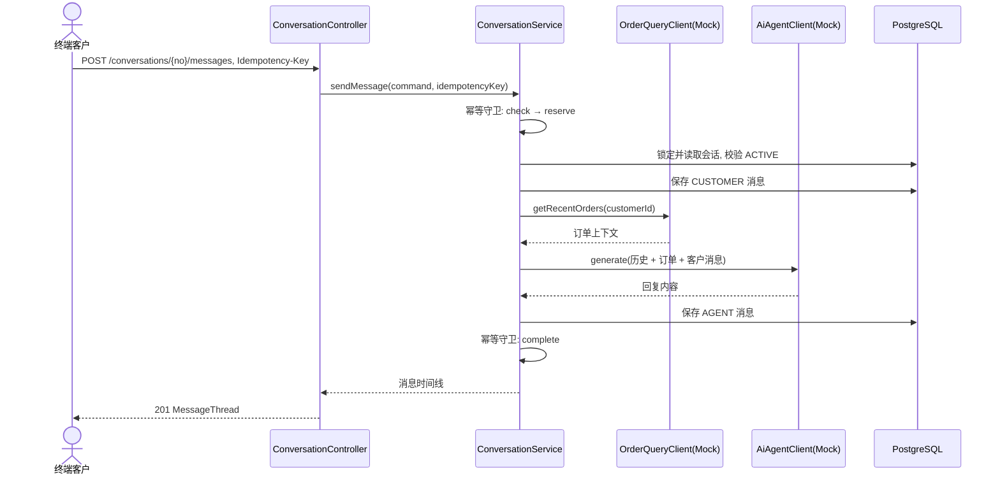
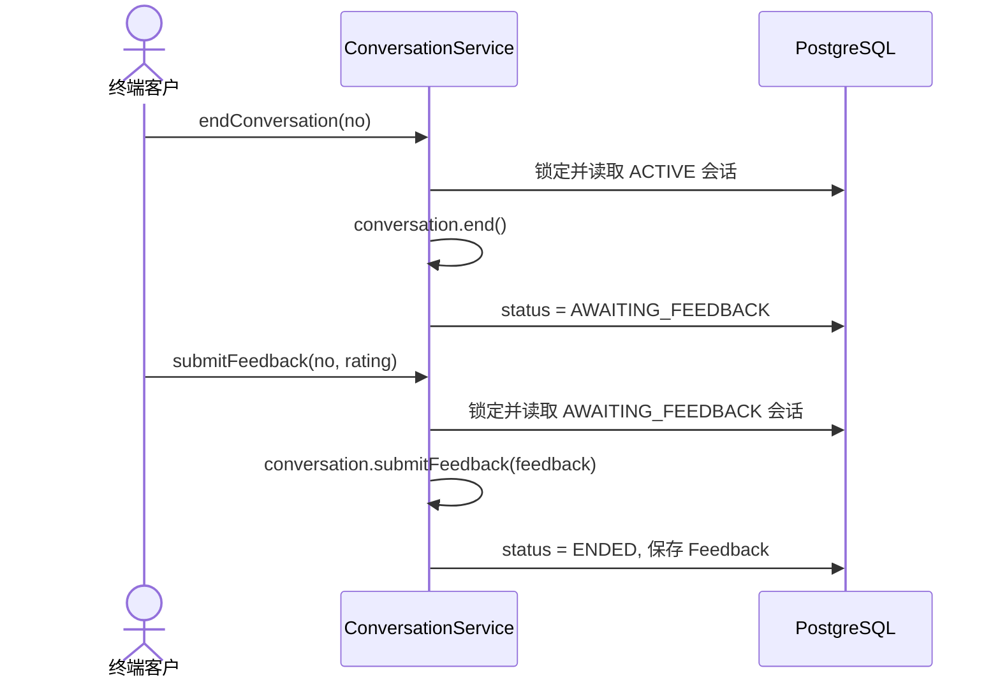

# 客服服务模块技术设计

## 1. 文档信息

- 模块：`customer-svc`
- 日期：2026-08-29
- 状态：待确认
- 目标：为终端客户提供演示级在线客服能力，覆盖会话生命周期、消息收发、会话评价、快捷问题和订单上下文联动
- 技术基础：Spring Boot 4.1.1、Spring MVC、Spring Data JPA、Flyway、PostgreSQL、MapStruct、Lombok

## 2. 已确认的业务决策

1. `customer-svc` 是纯业务编排层，通过出站端口调用 `customer-agent`（生成回复）和 `order-svc`（查询订单上下文）。本期两个出站端口均使用 Mock 适配器，仅在 `demo` Profile 下注册。
2. 本期只实现 `customer-svc`；`customer-agent` 作为独立 agent 应用，本期不实现真实逻辑，由 Mock 适配器替代。
3. 一个客户可创建多个会话；每个会话包含多条消息，消息角色为 `CUSTOMER` 或 `AGENT`。
4. 客户发送消息后，`customer-svc` 同步调用 AI Agent 生成回复，并将客户消息与客服回复在同一响应中返回。前端负责「正在输入」交互态。
5. 结束会话后进入待评价状态；客户提交满意度评价后会话才进入已结束状态。已结束或待评价的会话不再接受新消息。
6. 快捷问题由 `customer-svc` 作为后端参考数据管理，选择快捷问题等价于发送一条客户消息。
7. 生成 AI 回复时，`customer-svc` 始终通过 `OrderQueryClient` 获取客户近期订单作为上下文传入 AI Agent。这是演示简化，避免意图识别；真实场景可按需引入。
8. 消息发送是命令型操作且产生 LLM 外部调用副作用，必须携带 `Idempotency-Key`，与 `order-svc` 命令端点约定一致。
9. 不实现租户隔离、登录鉴权和操作权限。本约束仅适用于演示环境。

## 3. 目标与非目标

### 3.1 目标

- 展示完整且可验证的客服会话生命周期。
- 明确区分会话、消息和评价的状态与边界。
- 通过稳定出站端口隔离 AI 回复和订单查询两类外部能力。
- 使用 Mock 适配器演示成功、失败和幂等场景。
- 为终端客户和后台管理提供 REST API。

### 3.2 非目标

- 不实现 `customer-agent` 的真实 AI 回复逻辑。
- 不实现 `order-svc` 的真实订单查询逻辑。
- 不实现意图识别、多轮对话记忆、向量检索和 RAG。
- 不实现异步消息推送、WebSocket 或 SSE。
- 不实现人工坐席分配与转接。
- 不实现身份认证、权限校验和租户隔离。
- 不实现生产级消息总线和分布式事务。

## 4. 用例清单

### UC-01 创建会话

```gherkin
Given 客户提交合法的客户标识
When 客户创建会话
Then 系统生成唯一会话编号
And 会话状态为 ACTIVE
And 系统返回会话详情
```

### UC-02 发送消息并获取 AI 回复

```gherkin
Given 会话状态为 ACTIVE
And 客户提交非空消息内容
When 客户发送消息
Then 系统保存 CUSTOMER 角色消息
And 系统通过 OrderQueryClient 获取客户近期订单上下文
And 系统将消息历史与订单上下文传入 AiAgentClient
And 系统保存 AGENT 角色回复
And 系统返回客户消息与客服回复
```

### UC-03 阻止空消息

```gherkin
Given 消息内容仅包含空白字符
When 客户尝试发送
Then 系统返回 INVALID_REQUEST
And 不创建消息
And 不调用 AiAgentClient
```

### UC-04 已结束会话禁止发送消息

```gherkin
Given 会话状态为 AWAITING_FEEDBACK 或 ENDED
When 客户尝试发送消息
Then 系统返回 CONVERSATION_NOT_ACTIVE
And 不创建消息
And 不调用 AiAgentClient
```

### UC-05 使用快捷问题

```gherkin
Given 系统存在已启用的快捷问题
When 客户选择一个快捷问题
Then 系统将该问题文本作为客户消息发送
And 复用消息发送流程生成客服回复
```

### UC-06 查询快捷问题列表

```gherkin
When 客户请求快捷问题
Then 系统返回已启用的快捷问题列表
And 列表按排序字段升序排列
```

### UC-07 查询会话与历史消息

```gherkin
Given 会话存在
When 客户查询会话详情
Then 系统返回会话状态与消息时间线
And 消息按发送顺序排列
And 消息包含角色、内容与时间
```

### UC-08 结束会话

```gherkin
Given 会话状态为 ACTIVE
When 客户结束会话
Then 会话状态为 AWAITING_FEEDBACK
And 会话不再接受新消息
```

### UC-09 提交会话评价

```gherkin
Given 会话状态为 AWAITING_FEEDBACK
When 客户提交满意度评价
Then 系统保存评价记录
And 会话状态为 ENDED
And 已结束会话不可再次评价
```

### UC-10 重复发送幂等

```gherkin
Given 同一幂等键对应的消息发送已成功处理
When 客户使用相同幂等键再次发送
Then 系统返回已存储的回复结果
And 不重复创建消息
And 不重复调用 AiAgentClient
```

### UC-11 外部调用失败

```gherkin
Given Mock 外部能力被配置为本次调用失败
When 客服服务执行依赖该能力的命令
Then 系统返回明确的外部依赖错误
And 不伪造成功结果
And 允许使用同一幂等键重试
```

## 5. 模块边界

### 5.1 调用方

| 调用方 | 使用能力 |
| --- | --- |
| 终端客户 | 创建和查询会话、发送消息、使用快捷问题、结束会话、提交评价 |
| 后台管理 | 管理快捷问题目录、查看会话（本期不实现管理端界面，仅提供 Mock 管理 API） |

由于本期不实现鉴权，API 不根据调用方限制操作。调用方名称只用于说明使用场景，不代表安全边界。

### 5.2 输入

- 客户标识。
- 消息内容。
- 快捷问题标识。
- 满意度评价（满意 / 不满意）与可选评价留言。

### 5.3 输出

- 会话详情和会话列表。
- 会话状态、消息时间线和评价结果。
- 快捷问题列表。
- 可机器识别的错误码与错误详情。

### 5.4 依赖端口

```java
interface AiAgentClient {
    AgentReply generate(ReplyRequest request);
}

record ReplyRequest(
    String conversationNo,
    String customerId,
    List<MessageContext> recentMessages,
    List<OrderSummary> recentOrders,
    String customerMessage
) {}

record MessageContext(String role, String content, LocalDateTime createdAt) {}

record AgentReply(String content) {}

interface OrderQueryClient {
    List<OrderSummary> getRecentOrders(String customerId);
}

record OrderSummary(
    String orderNo,
    String status,
    BigDecimal payableTotal,
    String currency,
    LocalDateTime createdAt
) {}
```

### 5.5 不改的范围

- 不修改 `order-svc`、`customer-agent` 和 `rag-svc` 的职责。
- 不在客服数据库中维护订单主数据。
- 不把 Mock API 解释为未来真实外部 API；真实适配器必须单独实现并配置启用。

## 6. 领域模型

### 6.1 聚合划分

- `Conversation`：聚合根，负责消息序列、评价和会话状态迁移规则。
- `Message`：会话内一条消息，属于 `Conversation` 聚合。
- `Feedback`：会话评价，与 `Conversation` 一对一。

会话状态是客服交互的汇总状态；消息只有角色和时间序，无独立生命周期。

### 6.2 核心值对象

```java
enum MessageRole { CUSTOMER, AGENT }

enum FeedbackRating { SATISFIED, DISSATISFIED }
```

消息内容必须为去除首尾空白后的非空字符串。评价留言可选，长度上限 500 字符。

### 6.3 ER 图



数据库约束：

- `messages(conversation_id, seq_no)` 唯一。
- `feedback(conversation_id)` 唯一；一个会话最多一条评价。
- `idempotency_records(operation, idempotency_key)` 唯一。
- 消息内容不允许为空字符串；`seq_no` 必须大于零。
- 更新 `conversations` 时显式校验 `version`，受影响行数不是 `1` 时返回 `CONVERSATION_CONCURRENTLY_MODIFIED`。

## 7. 状态设计

### 7.1 会话状态

| 状态 | 含义 |
| --- | --- |
| `ACTIVE` | 会话进行中，可发送消息 |
| `AWAITING_FEEDBACK` | 客户已结束会话，等待评价 |
| `ENDED` | 评价已提交，会话终态 |

### 7.2 会话状态机



状态转换必须由领域方法完成，不允许应用层直接赋值：

```java
conversation.end();
conversation.submitFeedback(feedback);
```

任何未在状态机中声明的转换必须抛出领域异常，不能静默忽略。例如 `ENDED` 或 `AWAITING_FEEDBACK` 状态下发送消息抛出 `ConversationNotActiveException`。

### 7.3 消息与评价状态

```text
MessageRole = CUSTOMER | AGENT
FeedbackRating = SATISFIED | DISSATISFIED
```

消息一经创建不可修改、不可删除，保证时间线完整性。

## 8. 核心流程

### 8.1 创建会话



### 8.2 发送消息与生成回复



幂等守卫复用 `order-svc` 同款 `IdempotencyService` 模式：同一键 + 同一请求回放缓存结果；同一键 + 不同请求返回 `IDEMPOTENCY_KEY_REUSED`。

如果 AI Agent 调用失败，整个消息发送操作回滚——客户消息也不保存，幂等键保持空闲，客户可使用同一幂等键整体重试。这与 `order-svc` 幂等守卫的失败整体回滚模式一致。

### 8.3 结束会话与评价



## 9. API 设计

API 不使用路径版本号。所有请求必须携带 `API-Version: 1`；缺失或不支持的版本显式失败。所有命令型请求还必须携带 `Idempotency-Key` 请求头；同一键对应不同请求体时返回 `IDEMPOTENCY_KEY_REUSED`。

### 9.1 终端客户 API

| 方法 | 路径 | 用途 | 成功响应 | 幂等 |
| --- | --- | --- | --- | --- |
| `POST` | `/conversations` | 创建会话 | `201 ConversationDetail` | 是 |
| `GET` | `/conversations?customerId=&status=&page=&size=` | 查询会话列表 | `200 Page<ConversationSummary>` | 否 |
| `GET` | `/conversations/{conversationNo}` | 查询会话详情与消息 | `200 ConversationDetail` | 否 |
| `POST` | `/conversations/{conversationNo}/messages` | 发送客户消息 | `201 MessageThread` | 是 |
| `POST` | `/conversations/{conversationNo}/end` | 结束会话 | `202 ConversationDetail` | 是 |
| `POST` | `/conversations/{conversationNo}/feedback` | 提交评价 | `200 ConversationDetail` | 是 |
| `GET` | `/quick-questions` | 查询快捷问题 | `200 List<QuickQuestion>` | 否 |

### 9.2 演示专用 Mock API

Mock API 仅在 `demo` Profile 下注册；非 `demo` Profile 启动时不得暴露这些 Controller。

| 方法 | 路径 | 用途 |
| --- | --- | --- |
| `POST` | `/mock/quick-questions` | 新增快捷问题 |
| `PUT` | `/mock/orders/{customerId}` | 设置 Mock 订单上下文 |
| `PUT` | `/mock/agent/reply-rule` | 设置 Mock Agent 回复规则 |
| `PUT` | `/mock/failures/{capability}` | 设置指定外部能力下一次调用失败 |

### 9.3 主要请求示例

创建会话：

```json
{
  "customerId": "customer-001"
}
```

发送消息：

```json
{
  "content": "我的订单到哪了？"
}
```

提交评价：

```json
{
  "rating": "SATISFIED",
  "comment": "回复很快"
}
```

### 9.4 错误响应

使用 `application/problem+json`：

```json
{
  "type": "https://acm.example/problems/conversation-not-active",
  "title": "Conversation not active",
  "status": 409,
  "code": "CONVERSATION_NOT_ACTIVE",
  "detail": "Conversation C202608290001 is not active",
  "traceId": "..."
}
```

主要错误码：

| HTTP | 错误码 | 含义 |
| --- | --- | --- |
| `400` | `INVALID_REQUEST` | 消息内容为空或字段不合法 |
| `404` | `CONVERSATION_NOT_FOUND` | 会话不存在 |
| `409` | `CONVERSATION_NOT_ACTIVE` | 会话非 ACTIVE 状态，禁止发送消息 |
| `409` | `CONVERSATION_STATE_CONFLICT` | 当前状态不支持该操作 |
| `409` | `FEEDBACK_ALREADY_SUBMITTED` | 会话已评价 |
| `409` | `IDEMPOTENCY_KEY_REUSED` | 幂等键对应了不同请求 |
| `409` | `CONVERSATION_CONCURRENTLY_MODIFIED` | 乐观锁冲突 |
| `502` | `EXTERNAL_DEPENDENCY_FAILED` | Mock 外部能力显式失败 |

## 10. 应用结构

包结构以分层为主、能力为辅，与 `order-svc` 保持一致：

```text
org.acm.cs
├── interfaces                              # 适配器层（入站 + 出站）
│   └── http                                # 入站 REST 适配器
│       ├── controller                      # ConversationController、QuickQuestionController、MockController
│       ├── mapper                          # HTTP DTO 与 command/query/领域投影互转（MapStruct）
│       ├── request                         # 入站 DTO 与 Bean Validation 注解
│       ├── response                        # 出站 DTO
│       ├── exception                       # UnsupportedApiVersionException
│       └── GlobalExceptionHandler          # 统一 Problem Details 映射
├── application                             # 应用层
│   ├── port                                # 端口：驱动端 in + 被驱动端 out
│   │   ├── in                              # 入站用例端口
│   │   │   ├── ConversationUseCase
│   │   │   ├── command                     # CreateConversationCommand、SendMessageCommand、SubmitFeedbackCommand
│   │   │   └── query                       # SearchConversationQuery
│   │   └── out                             # 出站端口与端口契约异常 co-locate
│   │       ├── AiAgentClient + AiAgentUnavailableException
│   │       └── OrderQueryClient + OrderQueryUnavailableException
│   ├── service                             # 应用服务（实现入站端口）
│   │   ├── ConversationService             # 实现 ConversationUseCase
│   │   └── IdempotencyService              # 幂等守卫：check→reserve→execute→complete
│   ├── idempotency                         # 幂等记录实体与仓储（技术缓存表，非领域概念）
│   │   ├── IdempotencyRecord
│   │   └── IdempotencyRecordRepository
│   └── exception                           # 应用层异常
│       ├── IdempotencyKeyReuseException
│       └── ReservedByConcurrentWriterException
├── domain                                  # 领域层
│   ├── conversation                        # Conversation 聚合、Message、Feedback、ConversationRepository、
│   │                                       # ConversationStatus、ConversationNotActiveException
│   └── shared                              # 跨域支撑：AuditMetadata、BusinessException 基类、
│                                           # InvalidRequestException
└── infra                                   # 基础设施层（出站适配器 + 配置）
    ├── client                              # AiAgentClient 适配器（当前 Mock）、
    │                                       # OrderQueryClient 适配器（当前 Mock）
    └── AuditingConfig                      # JPA 审计配置
```

依赖方向：

```text
interfaces.http -> application.port.in（用例端口抽象）-> application.service -> domain
application.service -> application.port.out（出站端口抽象）
infra.client -> 实现 application.port.out 端口（依赖倒置）
infra -> domain（JPA 映射，声明式注解，不构成调用依赖）
domain -> 不依赖 interfaces 与 application
```

已确认的妥协：JPA 与 Spring Data 注解直接标注在领域对象上，仓储端口直接继承
`JpaRepository`，不引入独立的持久化 Row 模型；domain 层仍不得依赖 interfaces 与
application。幂等记录是技术缓存表而非业务领域概念，放在 `application.idempotency`。

`BusinessException`、`AuditMetadata`、`IdempotencyService` 和 `GlobalExceptionHandler`
在 `customer-svc` 本模块内自持一份（包名 `org.acm.cs`），与 `order-svc` 的 `org.acm.os`
副本平行。`common-lib` 当前只承载 HTTP 传输 DTO，不承载领域或应用层基类，本期不改该约定。

## 11. Mock 设计

### 11.1 行为要求

- Mock AI Agent 按回复规则返回内容；未命中规则时返回统一兜底文案。
- Mock OrderQuery 返回预设的客户订单摘要；未预设的客户返回空列表。
- Mock 快捷问题通过 Flyway 种子数据初始化，可通过 Mock API 增补。
- 未配置的回复规则或失败规则必须抛出明确异常，不使用隐式默认值。

### 11.2 Profile 配置

```yaml
spring:
  profiles:
    active: demo

customer:
  adapters:
    ai-agent: mock
    order-query: mock
```

每个适配器配置只接受已注册值。配置缺失或值未知时应用启动失败，不自动回退到 Mock。

## 12. 一致性、幂等与失败处理

### 12.1 本地一致性

- 单次状态转换与本地数据写入必须处于同一数据库事务。
- 应用服务读取会话后，通过 `@Version` 防止并发结束与评价。
- 领域校验先于外部调用执行；非 ACTIVE 状态不得调用 AI Agent。

### 12.2 外部调用

- AI Agent 调用必须接受幂等键，按同一键返回同一回复。
- 外部调用超时或失败必须抛出异常并记录明确失败状态。
- AI Agent 失败时整个操作回滚，客户消息不保存，幂等键保持空闲可整体重试。
- 不使用「捕获异常后记录日志并返回成功」的静默容错。

### 12.3 并发规则

```text
if optimisticLockConflict:
    reload conversation
    if same idempotency key already completed:
        return stored response
    else:
        throw CONVERSATION_CONCURRENTLY_MODIFIED
```

## 13. 校验规则

- `customerId` 不能为空。
- 消息内容去除首尾空白后必须非空。
- 会话必须处于 `ACTIVE` 状态才能发送消息。
- 会话必须处于 `ACTIVE` 状态才能结束。
- 会话必须处于 `AWAITING_FEEDBACK` 状态才能提交评价。
- 同一会话只能提交一次评价。
- 评价留言可选，长度上限 500 字符。
- 消息 `seq_no` 由服务端按会话内递增分配，调用方不得指定。

## 14. 可观测性

- 记录 `traceId`、`conversationNo`、`customerId` 和幂等键。
- 核心指标：
  - 创建会话次数；
  - 发送消息成功与失败次数；
  - AI Agent 调用成功与失败次数；
  - 结束会话与提交评价次数；
  - 各状态会话数量。

## 15. 测试策略

### 15.1 领域单元测试

- 覆盖会话状态机中的全部合法转换。
- 对每个未声明转换验证抛出明确领域异常。
- 覆盖空消息拒绝和重复评价拒绝。

### 15.2 应用服务测试

- 使用内存 Fake 端口验证调用顺序和幂等键传递。
- 覆盖 AI Agent 失败后的安全重试。
- 覆盖非 ACTIVE 会话发送消息被拒绝且不调用 Agent。
- 覆盖并发结束与评价的乐观锁冲突。

### 15.3 API 集成测试

- 使用 PostgreSQL 测试容器执行 Flyway 迁移。
- 按 UC-01 至 UC-11 编写端到端测试。
- 验证 Problem Details、HTTP 状态码和幂等响应。
- 验证非 `demo` Profile 不暴露 Mock API。

## 16. 实施顺序

1. 补齐 `build.gradle`（`common-lib` 依赖、MapStruct）。
2. 增加 Flyway 数据库迁移与 JPA 实体映射。
3. 实现会话、消息与评价领域模型及状态机单元测试。
4. 定义两个外部端口与显式 Mock 适配器。
5. 实现创建会话、发送消息、结束与评价流程。
6. 实现快捷问题目录与订单上下文联动。
7. 增加 REST API、统一错误响应和 OpenAPI 文档。
8. 完成 BDD 集成测试和指标。

## 17. 完成标准

- UC-01 至 UC-11 全部通过自动化测试。
- OpenAPI 中可以完整演示创建会话、发送消息、快捷问题、结束和评价。
- 任一非法状态转换都返回明确错误，不修改数据、不调用无关外部端口。
- 重复命令不产生重复消息或重复 AI 调用。
- 会话详情能展示完整消息时间线和评价结果。
- 关闭 `demo` Profile 后，Mock API 不可访问，缺失真实适配器时应用启动失败。
