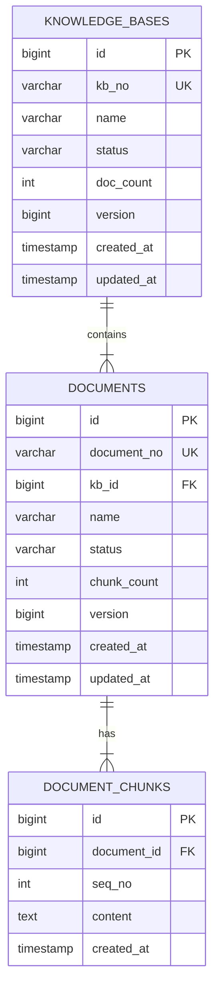
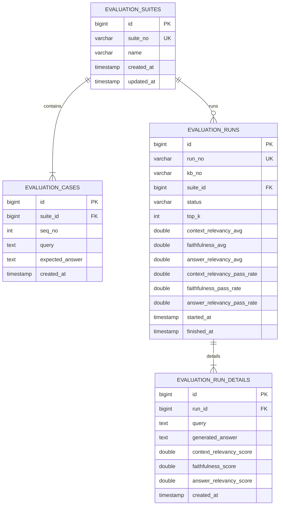
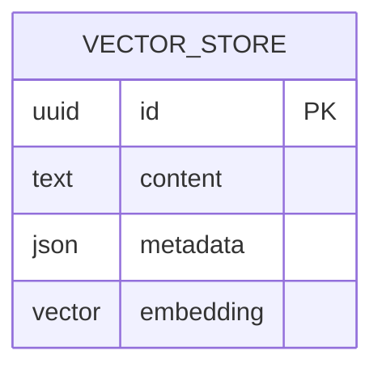
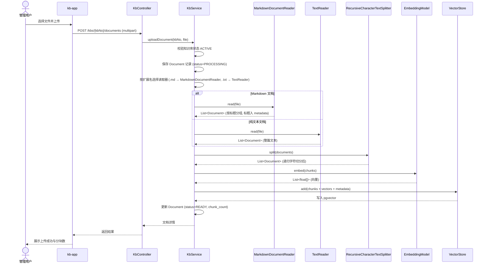
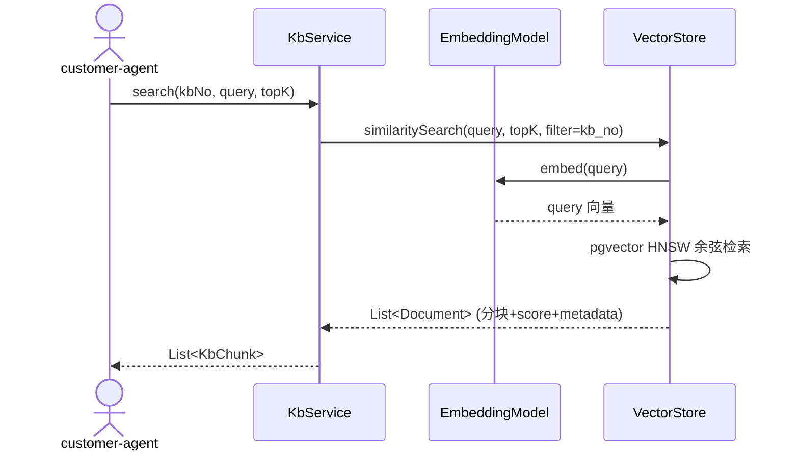
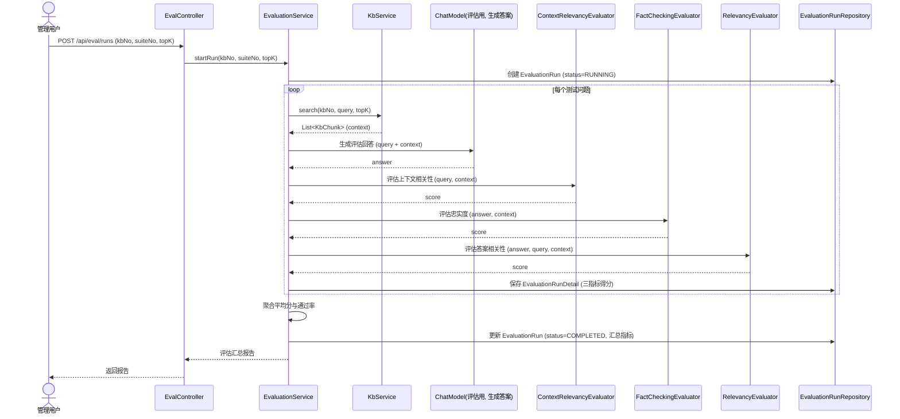
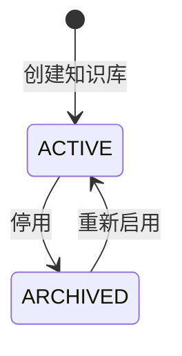
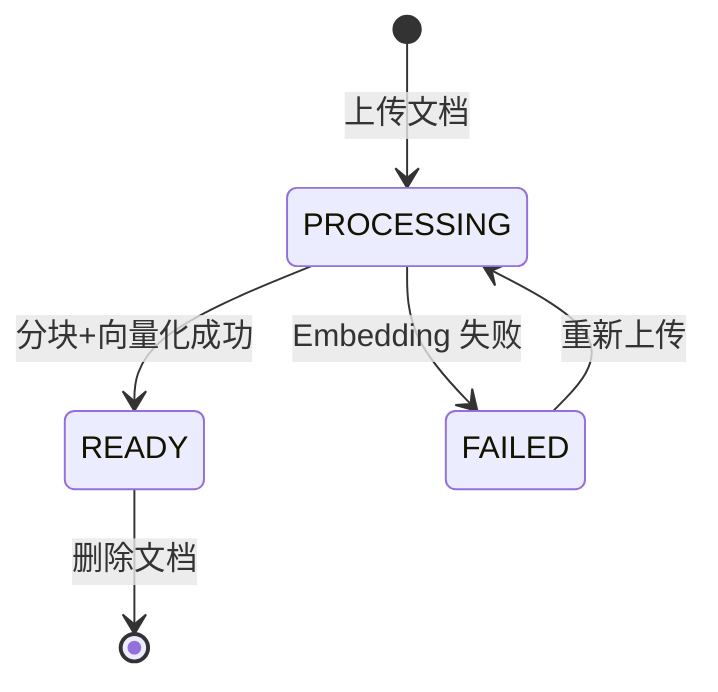
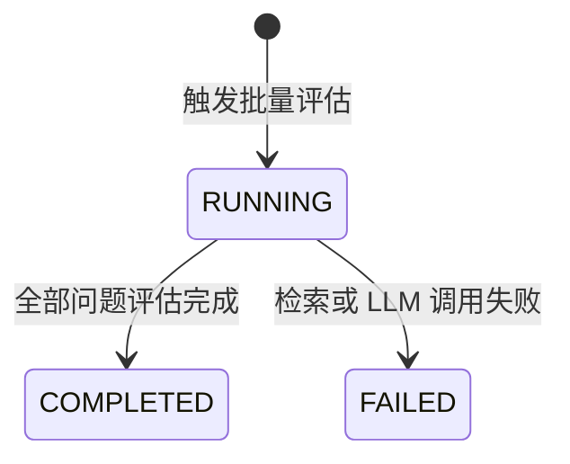
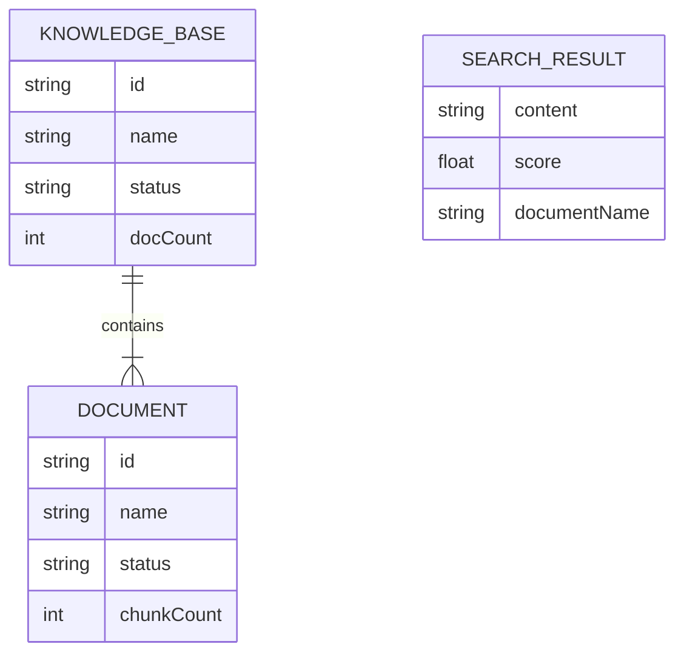

# 知识库管理服务模块技术设计

## 1. 文档信息

- 模块：`kb-svc`（原 `rag-svc` 改名）
- 日期：2026-08-29
- 状态：待确认
- 目标：为知识库管理提供基础服务，覆盖知识库 CRUD、文档上传、文本分块、向量化入库、相似度检索的完整链路
- 技术基础：Spring Boot 4.1.1、Spring AI 2.0.x、Spring Data JPA、Flyway、PostgreSQL（pgvector）、Lombok

## 2. 已确认的业务与技术决策

1. `rag-svc` 改名为 `kb-svc`，定位为"知识库管理基础服务"。包名从 `org.acm.rag` 改为 `org.acm.kb`，启动类从 `RagSvcApplication` 改为 `KbSvcApplication`。
2. 引入 Spring AI 2.0.x。官方文档明确声明"Spring AI 2.0.x supports Spring Boot 4.0.x and 4.1.x"，与本仓库 Spring Boot 4.1.1 兼容。
3. Embedding 使用阿里云百炼 `text-embedding-v4` 模型，通过百炼 OpenAI 兼容端点 `/compatible-mode/v1/embeddings` 接入。复用 `spring-ai-starter-model-openai`，仅配置 `base-url` 和 `api-key` 指向百炼，不引入阿里专属 SDK，不引入 `spring-ai-alibaba`（其版本 1.1.x 对齐 Spring AI 1.1.x / Boot 3.x，不兼容本仓库）。
4. 向量存储使用 `spring-ai-starter-vector-store-pgvector`。基础设施层 `docker-compose.yml` 已使用 `pgvector/pgvector:pg18`，无需新增基础设施。
5. kb-svc 只提供相似度检索 API（返回相关文档分块），不包含 LLM 生成。RAG 的 G（生成）由 `customer-agent` 负责，与现有架构分层一致。
6. 文档类型仅支持文本（.txt）和 Markdown（.md）。分块采用两段式：Markdown 文档先用 `MarkdownDocumentReader` 按 Markdown 标题切分（标题写入 metadata 的 `category` 与 `title` 字段），文本文档先用 `TextReader` 读取全文；再统一用自定义 `RecursiveCharacterTextSplitter` 对每个段落做递归字符切分。Spring AI 无此实现，需继承 `org.springframework.ai.transformer.splitter.TextSplitter` 并实现 `splitText(String)` 方法，算法移植自 LangChain 递归分隔符链。不引入 PDF 解析依赖。
7. 前端新增独立应用 `webapps/kb-app`，技术栈复刻 `customer-app`：React 19 + Vite 7 + Tailwind v4 + shadcn/ui 本地源码模式 + pnpm workspace。
8. 不实现租户隔离、登录鉴权和操作权限。本约束仅适用于演示环境。
9. 新增 RAG 评估系统（离线批量）：维护 benchmark 测试套件（问题集），触发评估时对每个问题执行"检索 context → 生成 answer → 三指标打分 → 汇总报告"。三个指标中忠实度用 Spring AI 内置 `FactCheckingEvaluator`，答案相关性用内置 `RelevancyEvaluator`，上下文相关性无内置实现需自定义 `Evaluator`。评估用 ChatModel（生成答案 + judge 打分）可复用百炼 OpenAI 兼容端点（qwen 系列），仅用于评估管线，不构成业务生成（决策 5 不变）。

## 3. 目标与非目标

### 3.1 目标

- 展示完整的知识库管理生命周期：建库、上传文档、分块、向量化、检索。
- 通过 Spring AI 标准抽象（`EmbeddingModel`、`VectorStore`、ETL 管道）实现 RAG 的 R（Retrieval）部分。
- 为 `customer-agent` 提供稳定的出站检索端口，供其拼装上下文生成回答。
- 提供 RAG 评估系统：对知识库检索质量做离线批量评估（上下文相关性、忠实度、答案相关性三个指标）。
- 为前端 `kb-app` 提供管理 REST API。
- 改名 `rag-svc` → `kb-svc`，同步更新所有引用点。

### 3.2 非目标

- 不实现 LLM 对话生成（由 `customer-agent` 负责）。
- 不实现 PDF、Word 等二进制文档解析。
- 不实现文档解析的 OCR、表格抽取、图片理解。
- 不实现异步批量入库、消息队列、流式检索。
- 不实现身份认证、权限校验和租户隔离。
- 不实现向量重排（rerank）和混合检索（hybrid search）。
- 不实现在线实时评估（每次检索都打分），仅离线批量。
- 不引入 Python 生态的 RAGAS / DeepEval / DeepChecks 框架（无 Java 原生实现）。

## 4. 用例清单

### UC-01 创建知识库

```gherkin
Given 客户提交合法的知识库名称
When 客户创建知识库
Then 系统生成唯一知识库编号
And 知识库状态为 ACTIVE
And 知识库文档数为 0
And 系统返回知识库详情
```

### UC-02 上传文档

```gherkin
Given 知识库存在且状态为 ACTIVE
And 客户提交非空的文本或 Markdown 文件
When 客户上传文档
Then 系统保存文档记录
And 系统按文档类型选择读取器（Markdown 用 MarkdownDocumentReader 按标题切分，纯文本用 TextReader）
And 系统通过 RecursiveCharacterTextSplitter 对每个段落做递归字符切分
And 系统将分块向量写入 pgvector
And 文档状态为 READY
And 系统返回文档详情与分块数
```

### UC-03 阻止空文档

```gherkin
Given 文档内容仅包含空白字符
When 客户尝试上传
Then 系统返回 INVALID_REQUEST
And 不创建文档记录
And 不调用 EmbeddingModel
```

### UC-04 已停用知识库禁止上传

```gherkin
Given 知识库状态为 ARCHIVED
When 客户尝试上传文档
Then 系统返回 KB_NOT_ACTIVE
And 不创建文档记录
And 不调用 EmbeddingModel
```

### UC-05 相似度检索

```gherkin
Given 知识库存在且包含已就绪的文档
When 客户提交检索查询文本和 topK 参数
Then 系统将查询文本向量化
And 系统在 pgvector 中执行余弦相似度检索
And 系统返回 topK 个最相似的分块
And 每个分块包含内容、相似度得分和来源文档信息
```

### UC-06 查询知识库列表

```gherkin
When 客户请求知识库列表
Then 系统返回所有知识库
And 列表包含名称、状态、文档数和创建时间
```

### UC-07 查询知识库详情与文档列表

```gherkin
Given 知识库存在
When 客户查询知识库详情
Then 系统返回知识库状态与文档列表
And 每个文档包含名称、状态、分块数和创建时间
```

### UC-08 删除文档

```gherkin
Given 文档存在于某个知识库
When 客户删除文档
Then 系统从 pgvector 删除该文档的所有分块向量
And 系统删除文档记录
And 知识库文档数递减
```

### UC-09 停用知识库

```gherkin
Given 知识库状态为 ACTIVE
When 客户停用知识库
Then 知识库状态为 ARCHIVED
And 该知识库不再接受新文档上传
And 该知识库仍可检索
```

### UC-11 触发离线批量评估

```gherkin
Given 知识库存在且包含已就绪的文档
And 存在评估测试套件（含至少一个问题）
When 客户对知识库触发批量评估
Then 系统为每个测试问题执行检索
And 系统生成评估回答
And 系统计算上下文相关性、忠实度、答案相关性三个指标
And 系统保存评估运行记录与每个问题的指标得分
And 评估状态为 COMPLETED
And 系统返回评估汇总报告
And 报告包含每个指标的平均分与通过率
```

### UC-12 查询评估运行与报告

```gherkin
Given 评估运行存在
When 客户查询评估运行
Then 系统返回评估状态、执行时间和汇总指标
And 每个测试问题的检索上下文、生成回答与三指标得分可见
```

## 5. 模块边界

### 5.1 调用方

| 调用方 | 使用能力 |
| --- | --- |
| 终端管理用户（通过 `kb-app`） | 创建知识库、上传文档、检索测试、管理文档 |
| `customer-agent` | 通过出站端口调用相似度检索，获取相关分块拼装上下文 |

由于本期不实现鉴权，API 不根据调用方限制操作。

### 5.2 输入

- 知识库名称。
- 文本或 Markdown 文件。
- 检索查询文本与 topK 参数。
- 评估触发请求（知识库编号 + 测试套件编号 + topK 参数）。

### 5.3 输出

- 知识库详情和列表。
- 文档详情（含分块数、状态）。
- 检索结果（分块内容、相似度得分、来源文档）。
- 评估汇总报告（三指标平均分与通过率）与逐问题明细。
- 可机器识别的错误码与错误详情。

### 5.4 依赖端口

```java
// 对内：相似度检索端口（供 customer-agent 通过 Mock 适配器调用）
interface KbSearchClient {
    List<KbChunk> search(SearchRequest request);
}

record SearchRequest(
    String kbNo,
    String query,
    int topK
) {}

record KbChunk(
    String content,
    double score,
    String documentNo,
    String documentName
) {}
```

评估系统依赖：评估管线内部直接调用 `KbService.search`（不经 HTTP），并用评估专用 ChatModel 生成回答与评判。评估不依赖外部 `customer-agent` 的生成能力。

### 5.5 不改的范围

- 不修改 `customer-svc`、`customer-agent`、`order-svc` 的职责。
- `customer-agent` 对 `kb-svc` 的调用本期使用 Mock 适配器，不实现真实 HTTP 调用。
- 不把 Mock API 解释为未来真实外部 API。

## 6. 领域模型

### 6.1 聚合划分

- `KnowledgeBase`：聚合根，负责文档集合管理和知识库状态迁移规则。
- `Document`：知识库内一份文档，属于 `KnowledgeBase` 聚合。
- `DocumentChunk`：文档分块，属于 `Document`，向量存储在 pgvector 中。
- `EvaluationSuite`：评估测试套件，聚合根，包含多个 `EvaluationCase`（测试问题）。
- `EvaluationRun`：一次评估运行，聚合根，记录执行状态与每个问题的三指标得分明细。

文档分块的向量数据不作为 JPA 实体管理，而是通过 Spring AI `VectorStore` 直接操作 pgvector 的 `vector_store` 表。`DocumentChunk` 仅在 JPA 层维护分块元数据（序号、内容摘要、所属文档）。

### 6.2 核心值对象

```java
enum KnowledgeBaseStatus { ACTIVE, ARCHIVED }
enum DocumentStatus { PROCESSING, READY, FAILED }
```

知识库名称必须为去除首尾空白后的非空字符串，长度上限 100 字符。

### 6.3 ER 图




评估 ER 说明：

- `evaluation_runs(kb_no, suite_id)` 标识一次对指定知识库的评估执行。
- 汇总指标（`*_avg`、`*_pass_rate`）在运行结束时计算并冗余存储，查询报告无需逐条聚合。
- `expected_answer` 为参考答案，可选；三个指标均为 reference-free（LLM-as-judge），不强制依赖参考答案。

pgvector 向量数据表（由 Spring AI `PgVectorStore` 自动管理，非 JPA 实体）：



`vector_store.metadata` JSON 中存储 `document_no`、`kb_no`、`seq_no`，用于检索时关联回 JPA 管理的文档元数据。

数据库约束：

- `document_chunks(document_id, seq_no)` 唯一。
- 文档内容不允许为空字符串。

## 7. 数据流

### 7.1 文档上传与向量化



### 7.2 相似度检索


### 7.3 离线批量评估



## 8. 状态机

### 8.1 知识库状态



### 8.2 文档状态


### 8.3 评估运行状态



## 9. API 接口

### 9.1 知识库管理

```
POST   /api/kbs                          创建知识库
GET    /api/kbs                          查询知识库列表
GET    /api/kbs/{kbNo}                   查询知识库详情（含文档列表）
POST   /api/kbs/{kbNo}/archive           停用知识库
POST   /api/kbs/{kbNo}/activate          重新启用知识库
```

### 9.2 文档管理

```
POST   /api/kbs/{kbNo}/documents         上传文档（multipart/form-data）
GET    /api/kbs/{kbNo}/documents         查询文档列表
DELETE /api/kbs/{kbNo}/documents/{docNo} 删除文档
```

### 9.3 检索

```
POST   /api/kbs/{kbNo}/search            相似度检索
```

请求体：

```json
{
  "query": "如何申请退款",
  "topK": 5
}
```

响应体：

```json
{
  "chunks": [
    {
      "content": "退款申请需在订单签收后 7 天内提交...",
      "score": 0.8732,
      "documentNo": "DOC-2026-0001",
      "documentName": "退款政策.md"
    }
  ]
}
```

### 9.4 对内检索端口

`customer-agent` 通过 Mock 适配器调用以下端口（与 `customer-svc` 的出站端口约定风格一致）：

```java
interface KbSearchClient {
    List<KbChunk> search(SearchRequest request);
}
```

### 9.5 评估管理

```
POST   /api/eval/suites                       创建评估测试套件
GET    /api/eval/suites                        查询测试套件列表
POST   /api/eval/suites/{suiteNo}/cases        向套件添加测试问题
POST   /api/eval/runs                          触发批量评估
GET    /api/eval/runs/{runNo}                  查询评估运行与报告
```

触发评估请求体：

```json
{
  "kbNo": "KB-2026-0001",
  "suiteNo": "EVAL-SUITE-001",
  "topK": 5
}
```

评估报告响应体：

```json
{
  "runNo": "EVAL-RUN-2026-0001",
  "kbNo": "KB-2026-0001",
  "status": "COMPLETED",
  "metrics": {
    "contextRelevancy": { "avgScore": 0.82, "passRate": 0.80 },
    "faithfulness": { "avgScore": 0.91, "passRate": 0.90 },
    "answerRelevancy": { "avgScore": 0.78, "passRate": 0.70 }
  },
  "details": [
    {
      "query": "如何申请退款",
      "generatedAnswer": "退款需在签收后7天内...",
      "contextRelevancyScore": 1.0,
      "faithfulnessScore": 1.0,
      "answerRelevancyScore": 0.0
    }
  ]
}
```

## 10. 项目结构

```text
org.acm.kb
├── KbSvcApplication                  # Spring Boot 启动入口
│
├── domain                             # 领域层
│   └── kb/
│       ├── KnowledgeBase              # 聚合根
│       ├── Document                   # 文档实体
│       ├── DocumentChunk              # 分块元数据实体
│       ├── KnowledgeBaseStatus        # ACTIVE / ARCHIVED
│       └── DocumentStatus             # PROCESSING / READY / FAILED
│
│   └── eval/
│       ├── EvaluationSuite            # 评估测试套件聚合根
│       ├── EvaluationCase             # 测试问题实体
│       ├── EvaluationRun              # 评估运行聚合根
│       ├── EvaluationRunDetail        # 逐问题三指标得分明细
│       ├── EvaluationRunStatus        # RUNNING / COMPLETED / FAILED
│       └── EvaluationMetrics          # 三指标聚合值对象
│
├── application                        # 应用层
│   ├── port/
│   │   ├── in/                        # KbUseCase + EvaluationUseCase（入站用例端口）
│   │   └── out/                       # KbSearchClient（出站检索端口）
│   ├── service/
│   │   ├── KbService                  # 实现 KbUseCase；编排上传→分块→向量化→入库
│   │   └── EvaluationService          # 实现 EvaluationUseCase；编排检索→生成→评估→汇总
│   └── command/                      # CreateKbCommand、UploadDocumentCommand、SearchCommand、StartEvalRunCommand
│
├── infra                              # 基础设施层
│   ├── vectorstore/
│   │   └── VectorStoreConfig          # PgVectorStore 配置（HNSW, COSINE, dimensions=1024）
│   ├── splitter/
│   │   └── RecursiveCharacterTextSplitter  # 自定义递归字符切分器（继承 TextSplitter）
│   ├── evaluator/
│   │   └── ContextRelevancyEvaluator  # 自定义上下文相关性 Evaluator（实现 Evaluator 接口）
│   └── client/                        # KbSearchClientImpl（Mock，demo Profile）
│
└── interfaces/                        # 适配器层
        ├── controller/               # KbController + EvalController
        ├── mapper/                    # MapStruct DTO 映射
        ├── request/                   # CreateKbRequest、SearchRequest DTO
        ├── response/                  # KbResponse、DocumentResponse、SearchResponse DTO
        └── exception/                 # GlobalExceptionHandler（Problem Details RFC 9457）
```

## 11. 技术决策

- **Spring AI 2.0.x**：官方明确支持 Spring Boot 4.1.x。通过 BOM 管理版本。
- **百炼 OpenAI 兼容端点**：`spring-ai-starter-model-openai` 配置 `base-url` 指向 `https://{WorkspaceId}.cn-beijing.maas.aliyuncs.com/compatible-mode/v1`，`api-key` 指向百炼 API Key，`model` 设为 `text-embedding-v4`，`dimensions` 设为 1024。不引入 `spring-ai-alibaba`（其 1.1.x 对齐 Spring AI 1.1.x / Boot 3.x，不兼容本仓库）。
- **PgVectorStore**：`spring-ai-starter-vector-store-pgvector`，`initialize-schema=true`，`index-type=HNSW`，`distance-type=COSINE_DISTANCE`，`dimensions=1024`。docker-compose 已就绪 pgvector/pgvector:pg18。
- **ETL 管道**（两段式切分）：第一阶段按文档类型选择读取器——Markdown 文档用 `MarkdownDocumentReader`（按标题分组切分，标题级别与标题文本写入 metadata 的 `category`、`title` 字段），纯文本文档用 `TextReader`（整篇读取为单个 Document）；第二阶段对所有段落统一用自定义 `RecursiveCharacterTextSplitter` 做递归字符切分，最后通过 `VectorStore` 写入 pgvector。详见 §11.1。
- **元数据关联**：pgvector `vector_store.metadata` JSON 存储 `document_no`、`kb_no`、`seq_no`，检索时通过 `filterExpression` 按 `kb_no` 过滤，并通过 `document_no` 关联回 JPA 文档元数据。
- **分层架构**：沿用 `order-svc` 范式（`interfaces.http → application.port.in → application.service → domain`）。JPA 注解直接标注在领域对象上，不引入独立持久化 Row 模型。
- **前端 `kb-app`**：React 19 + Vite 7 + Tailwind v4 + shadcn/ui 本地源码 + pnpm workspace，与 `customer-app` 完全一致。本期使用前端 Mock 数据演示，不接入真实后端 API。

### 11.1 自定义 RecursiveCharacterTextSplitter

Spring AI 2.0.x 的 `splitter` 包（`org.springframework.ai.transformer.splitter`）仅提供 `TextSplitter` 抽象类和 `TokenTextSplitter`，无 `RecursiveCharacterTextSplitter`。需自定义实现，算法移植自 LangChain 的递归字符切分。

**继承签名**（源码已确认）：

```java
package org.springframework.ai.transformer.splitter;

public abstract class TextSplitter implements DocumentTransformer {
    // 父类已实现 apply/split/split(Document)
    // 父类自动处理：提取 text/metadata/score/id → 调用 splitText → 构建 Document
    // 每个 chunk 自动注入 metadata: parent_document_id, chunk_index, total_chunks
    // 子类只需实现：
    protected abstract List<String> splitText(String text);
}
```

**自定义实现伪代码**：

```java
public class RecursiveCharacterTextSplitter extends TextSplitter {

    private final int chunkSize;
    private final int chunkOverlap;
    private final List<String> separators;

    // 默认分隔符链（优先级从高到低）：
    //   "\n\n" (段落) → "\n" (换行) → "。" (中文句号) → "." (英文句号) → " " (空格) → "" (逐字符)

    @Override
    protected List<String> splitText(String text) {
        // 1. 若 text 长度 <= chunkSize，直接返回 [text]
        // 2. 遍历分隔符链，找到第一个在 text 中出现的分隔符
        // 3. 按该分隔符切分 text 为多个片段
        // 4. 对每个片段：
        //    a. 若长度 <= chunkSize，加入结果集
        //    b. 若长度 > chunkSize，递归用下一个分隔符继续切分
        // 5. 合并相邻片段：若合并后长度 <= chunkSize 则合并（控制 chunkOverlap 重叠）
        // 6. 所有分隔符都未命中时，按 chunkSize 硬切（fallback 到逐字符）
    }
}
```

**配置参数**：

| 参数 | 默认值 | 说明 |
| --- | --- | --- |
| `chunkSize` | 1000 | 单块最大字符数 |
| `chunkOverlap` | 200 | 相邻块重叠字符数，保证上下文连续性 |
| `separators` | `["\n\n", "\n", "。", ".", " ", ""]` | 递归分隔符链，按优先级降序 |

**与 LangChain 原版的差异**：

- LangChain 原版基于 Python，默认分隔符含 `"\n\n"`、`"\n"`、`" "`、`""`。本实现额外加入中文句号 `"。"` 以优化中文文档切分质量。
- LangChain 原版的 `chunkSize` 按字符数计；本实现一致，不依赖 tokenizer。这是与 `TokenTextSplitter`（按 token 数计，依赖 `jtokkit`）的核心区别。

**放置位置**：`org.acm.kb.infra.splitter.RecursiveCharacterTextSplitter`，作为基础设施层组件，由 `KbService` 注入使用。

### 11.2 RAG 评估系统

**框架选型**：无 Java 原生 RAG 评估框架可用（RAGAS / DeepEval / DeepChecks 均为 Python；LangChain4j 已核实无评估模块）。采用 Spring AI 内置 `Evaluator` 抽象 + 自定义实现。

**三指标实现映射**（源码已核实）：

| 指标 | 实现 | 来源 | 评分方式 |
| --- | --- | --- | --- |
| 忠实度/可信度 | `FactCheckingEvaluator` | Spring AI 内置（`spring-ai-client-chat`，`org.springframework.ai.chat.evaluation`） | 判断 claim(answer) 是否被 document(context) 支持，YES→1/NO→0 二值 |
| 答案相关性 | `RelevancyEvaluator` | Spring AI 内置（同包） | 判断 response 是否与 query+context 一致，YES→1/NO→0 二值，prompt 可自定义 |
| 上下文相关性 | `ContextRelevancyEvaluator`（自定义） | 自定义，实现 `Evaluator` 接口 | LLM-as-judge：判断检索 context 是否与 query 相关，YES→1/NO→0 二值 |

**`Evaluator` 接口签名**（源码已确认，`spring-ai-commons`）：

```java
@FunctionalInterface
public interface Evaluator {
    EvaluationResponse evaluate(EvaluationRequest evaluationRequest);
    // doGetSupportingData() 把 dataList(List<Document>) 拼成 context 文本
}

// EvaluationRequest(userText, dataList, responseContent)
//   userText = 测试问题
//   dataList = 检索返回的 context 分块（List<Document>）
//   responseContent = 生成的 answer
// EvaluationResponse(passing, score, ...)
```

**评估用 ChatModel**：复用百炼 OpenAI 兼容端点（`spring-ai-starter-model-openai` 已含 ChatModel），配置独立的 `ChatClient.Builder`（评估专用，模型设为 qwen 系列，如 `qwen-plus`）。该 ChatModel 用于两个目的：

1. 评估管线内生成 answer（query + context → answer）。
2. 作为三个 Evaluator 的 judge 模型打分。

这不构成业务生成（决策 5 不变）——评估管线是独立测试能力，不暴露在知识库管理的业务 API 中。

**自定义 `ContextRelevancyEvaluator` 伪代码**：

```java
public class ContextRelevancyEvaluator implements Evaluator {

    private static final PromptTemplate PROMPT = new PromptTemplate("""
        你的任务是判断以下检索上下文是否与用户问题相关。
        只回答 YES 或 NO。YES 表示上下文包含回答问题所需的信息，NO 表示无关。

        用户问题：
        {query}

        检索上下文：
        {context}

        答案：
        """);

    private final ChatClient.Builder chatClientBuilder;

    @Override
    public EvaluationResponse evaluate(EvaluationRequest request) {
        String context = doGetSupportingData(request);
        String userMessage = PROMPT.render(Map.of(
            "query", request.getUserText(),
            "context", context));
        String result = chatClientBuilder.build().prompt().user(userMessage).call().content();
        boolean pass = "yes".equalsIgnoreCase(result != null ? result.strip() : "");
        return new EvaluationResponse(pass, pass ? 1f : 0f, "", Map.of());
    }
}
```

**评分聚合**：单问题三指标均为 0/1 二值。评估运行结束时对整个测试套件聚合：

- `avgScore` = 通过数 / 总数（等价于二值平均）。
- `passRate` = 通过数 / 总数（与 avgScore 相同，保留两个字段以兼容未来连续分制）。

**评估流程要点**：

- 评估管线内部直接调用 `KbService.search`（不经 HTTP），复用现有检索能力。
- 生成 answer 与 judge 打分均通过评估专用 ChatClient，不依赖 `customer-agent`。
- 评估为同步阻塞执行（演示规模），不引入异步任务框架。

## 12. 改名影响面

以下文件需同步更新：

| 文件 | 变更 |
| --- | --- |
| `rag-svc/` 目录 | 重命名为 `kb-svc/` |
| `rag-svc/build.gradle` → `kb-svc/build.gradle` | `description` 改为 `kb-svc` |
| `rag-svc/src/.../org/acm/rag/` → `kb-svc/src/.../org/acm/kb/` | 包名重命名 |
| `RagSvcApplication.java` → `KbSvcApplication.java` | 类名重命名 |
| `settings.gradle` | `include 'rag-svc'` → `include 'kb-svc'` |
| `docs/architecture.md` | 模块名 + 架构图 `RAG Service` → `KB Service` |
| `.agents/designs/2026-08-29-customer-service.md` §5.5 | `不改 rag-svc` → `不改 kb-svc` |

当前 `rag-svc` 仅有骨架代码（`RagSvcApplication`），无任何代码引用方，改名是干净切割。

## 13. 前端 kb-app

### 13.1 目标

为管理用户提供知识库管理界面，覆盖知识库列表、文档上传、检索测试的完整交互闭环。当前版本使用前端 Mock 数据，重点展示管理流程。

### 13.2 用例清单

#### 发起检索测试

```gherkin
Given 知识库已选择且包含文档
When 用户输入查询文本并发起检索
Then 页面立即显示检索结果
And 每个结果包含分块内容、相似度得分和来源文档
And 结果按相似度降序排列
```

#### 上传文档

```gherkin
Given 知识库已选择
When 用户选择文本或 Markdown 文件并上传
Then 页面展示上传进度
And Mock 延迟后展示分块数和就绪状态
```

#### 阻止空文件

```gherkin
Given 用户未选择文件或文件为空
When 用户尝试上传
Then 上传按钮保持禁用
And 不发起上传请求
```

### 13.3 模块边界

- 输入：知识库选择、文件选择、检索查询文本。
- 输出：知识库列表、文档列表、检索结果。
- 不改范围：不接入真实后端 API，不实现文件拖拽批量上传，不实现文档内容在线编辑。

### 13.4 核心对象



### 13.5 前端接口

当前阶段不存在网络 API。页面依赖以下显式 Mock 接口：

```ts
type MockKbService = {
  listKnowledgeBases(): Promise<KnowledgeBase[]>
  uploadDocument(kbId: string, file: File): Promise<Document>
  search(kbId: string, query: string, topK: number): Promise<SearchResult[]>
}
```

### 13.6 技术决策

- 使用 React + TypeScript + Vite，与 `customer-app` 一致。
- 使用 Tailwind CSS v4，通过 Vite 插件集成。
- UI 基础组件采用 shadcn/ui 本地源码模式，图标使用 Lucide React。
- 页面采用桌面端优先布局；左侧知识库列表，右侧文档列表与检索测试区。
- 所有知识库、文档、检索结果均来自前端 Mock 模块。
