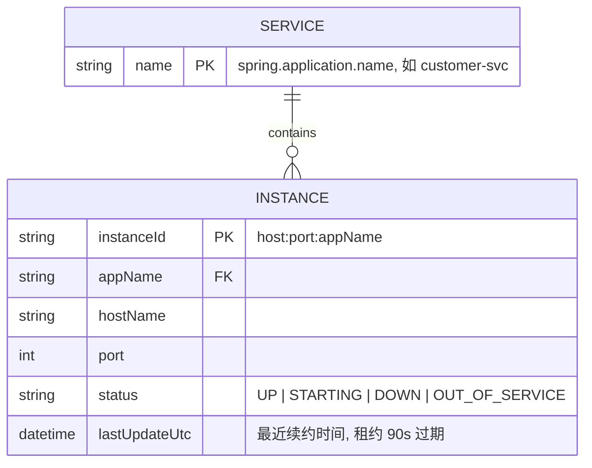
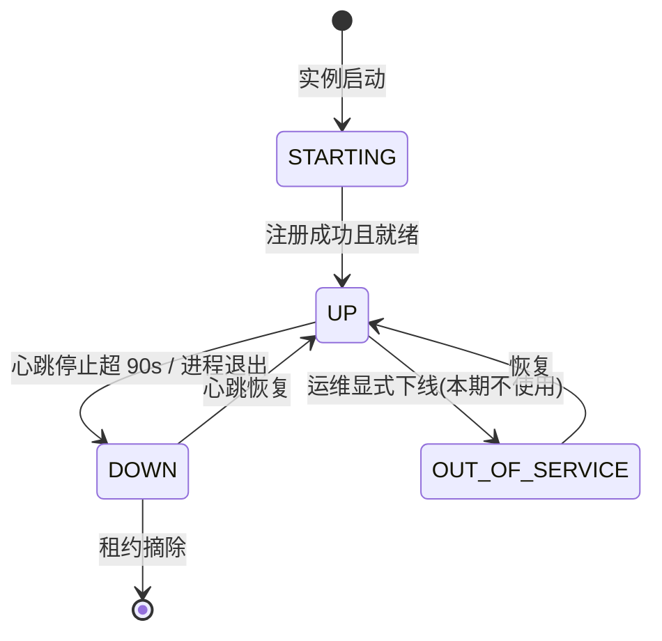
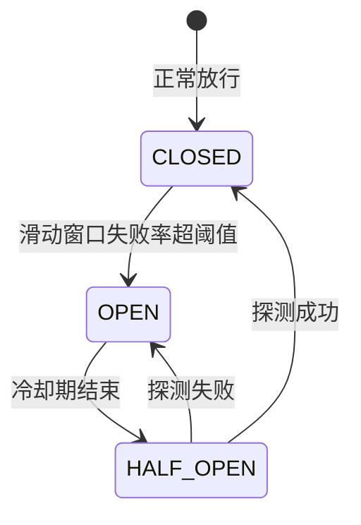
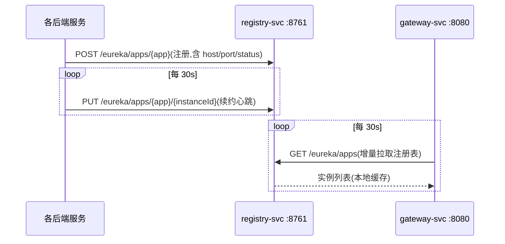
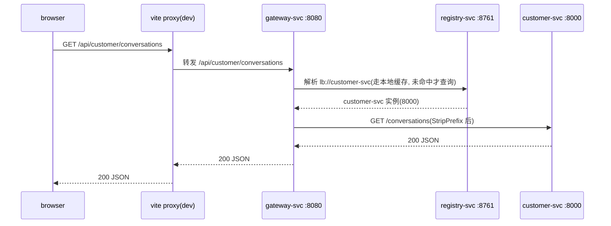
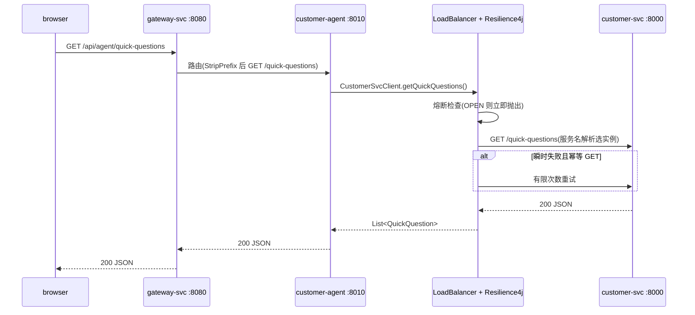

# 服务注册发现、网关、服务间调用与分布式追踪(service-discovery-gateway)

日期:2026-08-29
状态:已实施(实施偏差见 §16)

## 1. 背景与目标

当前 4 个 Spring Boot 服务(customer-agent、customer-svc、order-svc、kb-svc)独立运行、端口各异,前端直连各服务端口,服务间尚无任何 HTTP 互调(order-svc 适配器为进程内 mock,customer-agent 为空壳)。本期引入 Spring Cloud 三个最小组件与一项横切能力:

1. **registry-svc**:Eureka Server,服务注册发现
2. **gateway-svc**:Spring Cloud Gateway(WebFlux 运行时),统一入口
3. **服务间调用机制**:Spring Boot 4 原生声明式 HTTP Service Clients + Spring Cloud LoadBalancer + Resilience4j(超时/重试/熔断),本期以最小示例接线并沉淀接入规范
4. **分布式追踪(无后端)**:trace 上下文跨网关与服务传播,traceId/spanId 关联进日志;链路可视化后端本期不引入

全部后端服务注册到 Eureka;前端流量统一经 Gateway 进入。

版本事实(已查证):

| 项 | 值 | 依据 |
|---|---|---|
| Spring Boot | 4.1.1(现状) | settings.gradle |
| Spring Cloud | **2025.1.3**(Oakwood) | 2025.1.0/2025.1.1 与 Boot 4.1 不兼容,2025.1.2 起兼容;2025.1.3 为当前最新 GA |
| Gateway starter | `spring-cloud-starter-gateway-server-webflux` | 旧名 `spring-cloud-starter-gateway` 已废弃 |
| Eureka starter | `spring-cloud-starter-netflix-eureka-server` / `-client` | 命名未变 |
| 声明式客户端 | `@ImportHttpServices`(Spring Framework 7);属性前缀 **`spring.http.serviceclient.<group>.base-url`** | Boot 4 官方文档(旧前缀变体已废弃,配置错会静默失效) |
| 负载均衡 | Spring Cloud LoadBalancer 5.0 起原生支持 HTTP Service Clients(自动配置,服务名直连) | Spring Cloud 2025.1 发布说明 |
| 熔断/重试 | `spring-cloud-starter-circuitbreaker-resilience4j`(CircuitBreaker **5.0.3**,在 2025.1.3 BOM 内);Resilience4j 官方亦有 `resilience4j-spring-boot4` 2.4.0 | Maven Central |
| 追踪现状 | 4 个服务已统一 `spring-boot-micrometer-tracing-brave` + `micrometer-tracing-bridge-brave`;Boot 4 另有上报模块 `spring-boot-zipkin`、`spring-boot-micrometer-tracing-opentelemetry`(本期均不引入) | 仓库现状 + Maven Central |
| Java | 17(现状) | 根 build.gradle toolchain |

## 2. 用例描述清单(BDD)

### U1 服务注册

```gherkin
Feature: 服务注册
  Scenario: 后端服务启动后自动注册
    Given 任意一个后端服务启动(customer-agent 等 4 个之一)
    When 服务完成启动并通过 Eureka 客户端注册
    Then registry-svc 的注册表中出现该服务实例,状态为 UP
    And Eureka dashboard(http://localhost:8761)可见该实例
```

### U2 统一入口转发

```gherkin
Feature: 网关路由
  Scenario: 按服务前缀转发
    Given customer-svc 已注册到 registry-svc
    When 客户端请求 GET http://localhost:8080/api/customer/conversations
    Then gateway-svc 通过注册表解析 customer-svc 实例
    And 将请求转发到该实例的 /conversations 并原样返回响应
```

### U3 实例失效摘除

```gherkin
Feature: 实例失效
  Scenario: 实例下线后不再接收流量
    Given 某服务的一个实例已注册
    When 该实例心跳停止且租约过期(默认 90s)
    Then 注册表中该实例被标记为 DOWN 并最终摘除
    And gateway-svc 与服务间调用均不再路由到该实例
```

### U4 未匹配路由

```gherkin
Feature: 未匹配路由
  Scenario: 请求未知前缀
    When 客户端请求 GET http://localhost:8080/api/unknown/xxx
    Then gateway-svc 返回 404,不产生转发
```

### U5 前端统一接入

```gherkin
Feature: 前端统一入口
  Scenario: 前端经网关访问后端
    Given customer-app 的 API 前缀配置为 /api/customer
    And 开发期 vite proxy 将 /api 转发到 http://localhost:8080
    When 前端发起任意 API 请求
    Then 请求经 gateway-svc 到达目标服务
```

### U6 服务间调用(机制 + 最小示例)

```gherkin
Feature: 服务间调用
  Scenario: 按服务名调用
    Given customer-agent 与 customer-svc 均已注册到 registry-svc
    When customer-agent 通过声明式客户端 CustomerSvcClient 调用 quick-questions
    Then Spring Cloud LoadBalancer 经注册表解析 customer-svc
    And 调用到达其中一个实例并返回结果

  Scenario: 全链路验证
    When 客户端请求 GET http://localhost:8080/api/agent/quick-questions
    Then gateway-svc 路由到 customer-agent
    And customer-agent 经声明式客户端调用 customer-svc 并透传结果,返回 200

  Scenario: 调用失败快速失败
    Given customer-svc 无可用实例或调用超时
    When customer-agent 发起调用
    Then 抛出明确异常由调用方处理,不静默返回空值
```

### U7 熔断与重试(仅示例调用点)

```gherkin
Feature: 熔断与重试
  Scenario: 幂等 GET 调用瞬时失败后重试
    Given customer-agent → customer-svc 的 quick-questions 调用为幂等 GET 且配置了重试
    When 首次调用因瞬时故障失败
    Then 按有限次数重试,期间成功则正常返回

  Scenario: 熔断打开
    Given customer-svc 持续不可用且失败率超过阈值
    When customer-agent 发起调用
    Then 熔断打开,后续调用快速失败,请求不再打到目标服务
    And 冷却期后进入半开探测,恢复则闭合

  Scenario: 非幂等调用不自动重试
    Given 某调用为 POST(如未来的下单/支付)
    Then 该调用点默认不配置重试,仅超时与熔断
```

### U8 分布式追踪(日志关联,无后端)

```gherkin
Feature: 追踪上下文传播
  Scenario: 跨服务同一 trace
    Given 网关与各服务均启用 Micrometer Tracing(Brave,默认 B3 传播)
    When 客户端请求 GET /api/agent/quick-questions(经网关 → customer-agent → customer-svc)
    Then 三个服务的日志中出现相同 traceId
    And 各服务本地 span 记录请求处理,span 间父子关系正确

  Scenario: 全采样便于开发排查
    Given 开发环境采样率配置为 1.0
    Then 每个请求的日志都携带 traceId/spanId
```

### 异常流程

```gherkin
Scenario: registry-svc 不可用
  Given 各服务与 gateway-svc 均持有本地注册表缓存
  When registry-svc 宕机
  Then 既有实例间调用与既有路由短暂不受阻(使用本地缓存)
  And 新实例注册与发现不可用,registry-svc 恢复后自愈
```

## 3. 模块边界

### 新增

| 模块 | 职责 | 输入 | 输出 | 不做 |
|---|---|---|---|---|
| registry-svc(:8761) | 服务注册发现(Eureka Server) | 注册/心跳/查询请求 | 实例注册表(内存)+ REST API + dashboard | 配置中心、鉴权、持久化、集群化 |
| gateway-svc(:8080) | 统一入口与路由 | 外部 HTTP 请求 | 经 `lb://` 负载均衡转发 | 业务逻辑、鉴权、限流(本期) |

### 修改(存量)

| 对象 | 改动 |
|---|---|
| customer-svc / order-svc / kb-svc / customer-agent | 增加 `spring-cloud-starter-netflix-eureka-client` 依赖与注册配置 |
| customer-agent | 新增声明式客户端 `CustomerSvcClient`(服务间调用示例)与示例端点 `GET /quick-questions`(内部调 customer-svc);新增 resilience4j 熔断/重试配置(仅此调用点) |
| gateway-svc | 补 Brave bridge 追踪依赖(与存量服务同款),保证网关段 trace 连续 |
| 4 个存量服务 | 追踪依赖已在位,仅补采样率配置(见 §13) |
| order-svc | 端口显式化为 **8020**(原默认 8080,让位给 Gateway) |
| customer-agent | 端口显式化为 **8010**(原默认 8080,与 order-svc 冲突) |
| kb-svc | Controller 路径归一:`/api/kbs → /kbs`、`/api/eval → /eval`(见 §6 决策) |
| webapps/customer-app | `VITE_API_BASE_URL=/api/customer`;vite proxy 改为 `/api → http://localhost:8080` |
| webapps/kb-app | 本次不接线(当前仅 mock),仅预留 `/api/kb` 前缀约定 |
| Taskfile.yml | `run-all` 增加先启 registry-svc,再启 gateway-svc 与各服务 |

### 不改

- 各服务业务逻辑、数据库 schema、Flyway 脚本
- common-lib
- 镜像构建方式(bootBuildImage 自动覆盖新模块)
- docker-compose(本期不做容器编排,Eureka 地址留环境变量)

## 4. 端口规划

| 模块 | 端口 | 变化 |
|---|---|---|
| gateway-svc | 8080 | 新增,统一入口 |
| registry-svc | 8761 | 新增,Eureka 惯例端口 |
| customer-svc | 8000 | 不变 |
| kb-svc | 8001 | 不变 |
| customer-agent | 8010 | 显式化 |
| order-svc | 8020 | 显式化(原 8080) |

## 5. 端口与注册配置(各服务)

```yaml
eureka:
  client:
    service-url:
      defaultZone: ${EUREKA_SERVER_URL:http://localhost:8761}/eureka/
  instance:
    prefer-ip-address: true
```

## 6. 网关路由设计

规则:**服务内部路径不带服务前缀,网关负责加 `/api/{服务}` 前缀并 StripPrefix=2**(剥掉 `api` 与服务名两段)。

| 外部路径 | 目标 | 转发后路径 |
|---|---|---|
| `/api/customer/**` | `lb://customer-svc` | `/**` |
| `/api/order/**` | `lb://order-svc` | `/**` |
| `/api/kb/**` | `lb://kb-svc` | `/**` |
| `/api/agent/**` | `lb://customer-agent` | `/**` |

路由骨架(伪代码):

```yaml
spring.cloud.gateway.server.webflux.routes:
  - id: customer-svc
    uri: lb://customer-svc
    predicates: [ "Path=/api/customer/**" ]
    filters:  [ "StripPrefix=2" ]
  # order / kb / agent 同构
```

**决策:kb-svc 路径归一**。现状 kb-svc 路径自带 `/api` 前缀(`/api/kbs`、`/api/eval`),与其余服务不一致;若保留,则出现 `/api/kb/api/kbs` 的双重前缀。由于 kb-app 前端尚未接真实 API(当前仅 mock 数据),归一为零破坏。归一后 kb 路由与其他服务完全同构。

**/mock 歧义说明**:customer-svc 与 order-svc 都有 `/mock` 路径;按服务前缀路由后,二者分别走 `/api/customer/mock/**` 与 `/api/order/mock/**`,天然消解。

## 7. 服务间调用设计

### 7.1 机制

Spring Boot 4 原生声明式 HTTP Service Clients + Spring Cloud 2025.1 透明集成(负载均衡、熔断),不引入 OpenFeign(社区弃用风险,Boot 4 下有原生替代)。

调用伪代码(以 customer-agent 调 customer-svc 为例):

```java
// 1. 声明接口(Spring Framework 7 @HttpExchange)
public interface CustomerSvcClient {

    @GetExchange("/quick-questions")
    List<QuickQuestionView> getQuickQuestions();
}

// 2. 注册为 HTTP Service Group
@Configuration
@ImportHttpServices(group = "customer-svc", types = CustomerSvcClient.class)
class HttpClientConfig {
}

// 3. 注入即用,URI 里的 customer-svc 由 LoadBalancer 经 Eureka 解析
CustomerSvcClient client;  // base-url = http://customer-svc
```

关键事实:

- 属性前缀为 `spring.http.serviceclient.<group>.base-url`(Boot 4 已统一;写错前缀会静默失效,启动时必须显式校验 base-url 存在,FAIL-FAST)
- Spring Cloud LoadBalancer 5.0 起对 HTTP Service Clients 自动配置负载均衡,base-url 直接写服务名 `http://customer-svc`
- 不直接定制全局 `RestClient.Builder`(2025.1.0 存在启动兼容问题),定制一律走 group 级 configurer

### 7.2 容错策略(超时 / 重试 / 熔断)

| 策略 | 规则 |
|---|---|
| 超时 | 每个调用组显式配置连接与读超时,无默认裸奔 |
| 重试 | **仅幂等调用**(GET);有限次数 + 短退避;POST/非幂等禁止自动重试 |
| 熔断 | 按调用组隔离;无业务 fallback 的调用点,熔断打开即快速失败(不伪造降级数据);有 fallback 的调用点由调用方显式实现 |
| 失败语义 | FAIL-FAST:异常大声抛出,严禁静默吞掉返回空值 |

伪代码配置(具体配置项名以 spring-cloud-circuitbreaker 5.0.3 文档为准,实现时核对):

```yaml
spring:
  http:
    serviceclient:
      customer-svc:
        base-url: http://customer-svc
        connect-timeout: 1s
        read-timeout: 3s
resilience4j:
  circuitbreaker:
    instances:
      customer-svc:
        sliding-window-size: 10
        failure-rate-threshold: 50
        wait-duration-in-open-state: 30s
  retry:
    instances:
      customer-svc:
        max-attempts: 3
        wait-duration: 200ms
```

### 7.3 接入规范(新增调用点必须遵守)

1. 为目标服务声明 `@HttpExchange` 接口,归入以服务名命名的 HTTP Service Group
2. `spring.http.serviceclient.<group>.base-url` 必须显式配置为 `http://<服务名>`,缺失即启动失败
3. 显式声明该调用是否幂等 → 幂等才允许配重试
4. 显式声明失败时的行为:快速失败 或 显式 fallback;禁止静默容错
5. 每个调用组独立超时/熔断/重试配置,禁止全局默认套用

## 8. 数据建模

注册表为 Eureka 内存态(基础设施数据,非业务库,不落 PostgreSQL):



## 9. 状态机

服务实例状态生命周期(由 Eureka 客户端与服务端维护,本期不人工干预):



熔断器状态机(每个调用组独立实例):



## 10. 数据流

### 注册与续约



### 前端请求全链路(以客服会话为例)



### 服务间调用全链路(示例:customer-agent → customer-svc)



## 11. API 接口

本期不新增业务 API,新增的是基础设施端点与一个示例端点:

| 端点 | 说明 |
|---|---|
| `GET http://localhost:8761` | Eureka dashboard(观察注册表) |
| `GET/POST/PUT/DELETE http://localhost:8761/eureka/v2/apps/**` | Eureka 标准 REST(客户端自动使用) |
| `GET http://localhost:8080/actuator/gateway/routes` | 观察网关生效路由 |
| `GET http://localhost:8080/api/agent/quick-questions` | 服务间调用示例端点(customer-agent 内部调 customer-svc) |

对外暴露给前端/第三方的 API 面完全不变,仅入口端口与路径前缀变化。

## 12. 构建与依赖

```groovy
// 根 build.gradle(所有启用 dependency-management 的子项目共享)
subprojects {
    pluginManager.withPlugin('io.spring.dependency-management') {
        dependencyManagement {
            imports {
                mavenBom "org.springframework.cloud:spring-cloud-dependencies:2025.1.3"
            }
        }
    }
}
```

```groovy
// registry-svc
dependencies {
    implementation 'org.springframework.cloud:spring-cloud-starter-netflix-eureka-server'
    // web 容器按 Boot 4 starter 实际要求补齐, 以能启动为准
}

// gateway-svc
dependencies {
    implementation 'org.springframework.cloud:spring-cloud-starter-gateway-server-webflux'
    implementation 'org.springframework.cloud:spring-cloud-starter-netflix-eureka-client'
    implementation 'org.springframework.boot:spring-boot-micrometer-tracing-brave'
    implementation 'io.micrometer:micrometer-tracing-bridge-brave'
}

// 4 个存量服务各加
implementation 'org.springframework.cloud:spring-cloud-starter-netflix-eureka-client'

// customer-agent 额外加(服务间调用示例)
implementation 'org.springframework.cloud:spring-cloud-starter-circuitbreaker-resilience4j'
// (loadbalancer 由 eureka-client 传递依赖, 不重复声明)
```

`settings.gradle` 增加 `include 'registry-svc'`、`include 'gateway-svc'`。

## 13. 配置骨架

```yaml
# registry-svc
server:
  port: 8761
eureka:
  client:
    register-with-eureka: false   # 单节点, 不自注册
    fetch-registry: false
```

```yaml
# gateway-svc
server:
  port: 8080
spring.cloud.gateway.server.webflux.routes:  # 见 §6
eureka.client.service-url.defaultZone: ${EUREKA_SERVER_URL:http://localhost:8761}/eureka/
```

```yaml
# 各服务与 gateway-svc(追踪)
management:
  tracing:
    sampling:
      probability: 1.0   # dev 全采样, 生产另配
```

追踪行为说明(无需代码):

- 传播协议:内部统一 Brave 默认 **B3**;网关(基于 Observation)与声明式 HTTP Service Clients(基于 Boot 对 RestClient 的自动插桩)自动注入/提取 trace 头
- 日志关联:Boot 自动将 traceId/spanId 写入日志模式,不做额外配置
- registry-svc 不引追踪(基础设施组件,不在业务链路上)

开发期 CORS:前端经 vite proxy 属同源转发,不需要 CORS;生产如需跨域,在 gateway-svc 统一配置 `allowed-origins`(预留,本期不启用具体域名)。

## 14. 测试与验收

- 各存量服务 `task test-svc SVC=xxx` 回归通过(加依赖不破坏现有测试)
- gateway-svc 路由定义单测;customer-agent 服务间调用单测(mock 注册表场景)
- 全链路冒烟清单:
  1. `task run-all`(registry 先于 gateway 与各服务启动)
  2. dashboard :8761 可见 4 个服务实例 UP
  3. `curl http://localhost:8080/api/customer/quick-questions` 返回 200
  4. `curl http://localhost:8080/api/order/orders` 返回 200
  5. `curl http://localhost:8080/api/agent/quick-questions` 返回 200(验证服务间调用全链路)
  6. 步骤 5 的请求,比对 customer-agent 与 customer-svc 日志中 traceId 一致(验证追踪传播)
  7. `curl http://localhost:8080/api/unknown/x` 返回 404
  8. 停掉 customer-svc 后重复步骤 5,观察熔断/重试日志行为
  9. customer-app 页面正常走查会话流程
- 质量门禁:代码改动后执行 `review-acm-code`

## 15. 风险与后续

| 风险/后续 | 说明 |
|---|---|
| Eureka Server 在 Boot 4 下的 web starter 组合 | 以实际启动为准,可能需补 `spring-boot-starter-webmvc` |
| 路由属性前缀 | Boot 4 下为 `spring.cloud.gateway.server.webflux.*`(旧前缀 `spring.cloud.gateway.*` 部分场景失效,已查证) |
| `spring.http.serviceclient` 前缀曾变更 | 写错前缀静默失效;实现时以当前 Boot 文档为准,并加启动校验 |
| 熔断/重试配置项名 | Spring Cloud 2025.1 对 HTTP service groups 的透明熔断集成细节,实现时按 spring-cloud-circuitbreaker 5.0.3 文档核对 |
| 跨服务 trace 连续性 | 依赖 Boot 对 RestClient 的自动 Observation 与网关插桩;实现时以日志比对验证,断链则排查插桩依赖 |
| 传播协议 | 内部统一 B3(Brave 默认);后续需对外暴露 trace 或跨系统互联时评估切 W3C traceparent |
| 链路可视化后端 | 本期不引入;接 Zipkin = 加 `spring-boot-zipkin` 模块 + endpoint 配置 + 一个容器;接 OTel 生态 = 切 `spring-boot-micrometer-tracing-opentelemetry` + `spring-boot-opentelemetry`(OTLP) |
| 存量问题(非本期引入) | order-svc 本地库 Flyway 校验和不一致(V1/V2 应用后被改),无法本地启动,需 `flyway repair` 或重建库;kb-svc 依赖 `DASHSCOPE_API_KEY`,本机未配置故未做冒烟 |

## 16. 实施记录(与设计的偏差与发现)

实施过程中查证并落地了以下与 §7/§12/§13 原文不同的最终形态:

### 16.1 HTTP Service Client 完整集成需要 `spring-boot-restclient` 模块

Boot 4 模块化后,`spring-boot-starter-webmvc` **不包含** HTTP client 属性机制。缺它时 `@ImportHttpServices` 仍能创建代理客户端,但 `spring.http.serviceclient.*` 属性(base-url/超时)与观测插桩全部静默失效(表现为 `Target host is not specified`、trace 断链)。必须显式添加:

```groovy
implementation 'org.springframework.boot:spring-boot-http-client'    // 属性元数据
implementation 'org.springframework.boot:spring-boot-restclient'    // HttpServiceClientAutoConfiguration + 观测挂接
```

### 16.2 LoadBalancer 集成:补 `spring-boot-restclient` 后由 SC 链路自动接管

Spring Cloud 2025.1.3 的 `LoadBalancerRestClientHttpServiceGroupConfigurer` 类存在但默认注册链路不完整:仅加 eureka-client 时,`@ImportHttpServices` 客户端无 base-url、无 LB(表现为 `Target host is not specified`)。补 `spring-boot-restclient` 模块后,SC commons 的 LB 请求链(`BlockingLoadBalancerRequest` 等)自动接管 `lb://` base-url 的实例解析与重写,无需手写拦截器。

曾实现自定义 `LoadBalancerInterceptor`(choose + 重写 URI),在其上游已有 SC 链路解析的情况下冗余,已移除;保留 `HttpClientConfig` 构造期门禁校验(base-url 必须为 `lb://customer-svc`,否则启动失败,FAIL-FAST)。

### 16.3 base-url 用 `lb://` 协议

```yaml
spring.http.serviceclient.customer-svc:
  base-url: lb://customer-svc   # 服务名, 由 LB 拦截器解析
  connect-timeout: 1s
  read-timeout: 3s
```

### 16.4 熔断/重试落地为 resilience4j-spring-boot4

透明熔断集成(`spring.cloud.circuitbreaker.http-services.*`)在 SC 2025.1.3 亦未自动注册,且官方集成不含重试。最终采用 `resilience4j-spring-boot4:2.4.0` + `aspectjweaver`,在 `QuickQuestionService` 上以 `@Retry` + `@CircuitBreaker` 显式标注,实例名统一为 `customer-svc`。Retry 配置 `ignore-exceptions: CallNotPermittedException`,熔断打开时秒拒不再重试。

版本注意:SC BOM 会传递 `resilience4j-bom` 2.3.0,与 spring-boot4 模块(2.4.0 起)混装;根 build.gradle 已在 SC BOM 之后后置导入 `resilience4j-bom:2.4.0` 覆盖,全量对齐 2.4.0。

启动门禁(review F3):`HttpClientConfig` 构造期校验 base-url 必须为 `lb://customer-svc`,缺失或改值即启动失败。装配由 `ResilienceWiringTest` 验证(实例名拼写 + yml 配置生效)。

### 16.5 日志关联需显式 pattern

Boot 4 默认日志格式的关联槽位为空。各服务统一配置:

```yaml
logging:
  pattern:
    correlation: "[${spring.application.name:},%X{traceId:-},%X{spanId:-}] "
```

(注:向 `management.tracing.baggage.correlation.fields` 追加 traceId/spanId 会因默认已包含而启动报错,勿用。)

### 16.6 网关路由观察端点需放开访问权

Boot 4 引入端点访问权概念,`/actuator/gateway/routes` 默认 access=NONE:

```yaml
management:
  endpoint:
    gateway:
      access: unrestricted
  endpoints:
    web:
      exposure:
        include: gateway,health
```

(生产环境必须收敛:access 移除或收窄、exposure 仅留 health——该端点支持运行时改路由。)

### 16.7 存量测试修复

`NonDemoProfileStartupTest` 断言"非 demo profile 启动必须失败",与 45589af(移除 mock 的 profile 门控)相悖,在 main 上本就失败。已按现行设计重写为 `MockAdapterStartupTest`(非 demo 启动成功且 mock 适配器无条件注册),并同步修正两个 mock 实现的失实 Javadoc 与无用 import。`customer-agent` 移除了未使用的 JPA/Flyway/PostgreSQL/H2 依赖与 springdoc 依赖(空壳模块无数据面/无 API 文档需求,此前因缺 datasource 配置无法启动;待 agent 有业务 API 时随业务设计补 springdoc)。

### 16.8 其他实施偏差

- registry-svc 显式关闭 `eureka.server.enable-self-preservation`(单节点下续约阈值必然触发自保护,导致死实例永不摘除,U3 不成立)
- Taskfile `run-all` 各服务并行启动(含 registry),不保证注册中心先就绪;Eureka 客户端自动重试注册,dev 场景可接受
- customer-app 前端 API 前缀置于 `.env.development`(`.env` 被 .gitignore 忽略且会被 vitest 加载污染测试);生产构建的 API 接入方式(nginx 反代或 `.env.production`)留待部署设计决策
| 全局 RestClient.Builder 定制 | 2025.1.0 存在启动兼容问题,定制一律走 group 级 configurer |
| Eureka 健康检查 | 默认心跳模式;后续可接 actuator health |
| docker 编排 | 本期不做;`EUREKA_SERVER_URL` 环境变量已预留 |
| 配置中心 | 本期不做;若需要可后续评估 Nacos |
| 鉴权 | 网关与服务间调用均无鉴权,属后续迭代(统一入口后天然具备收口点) |
