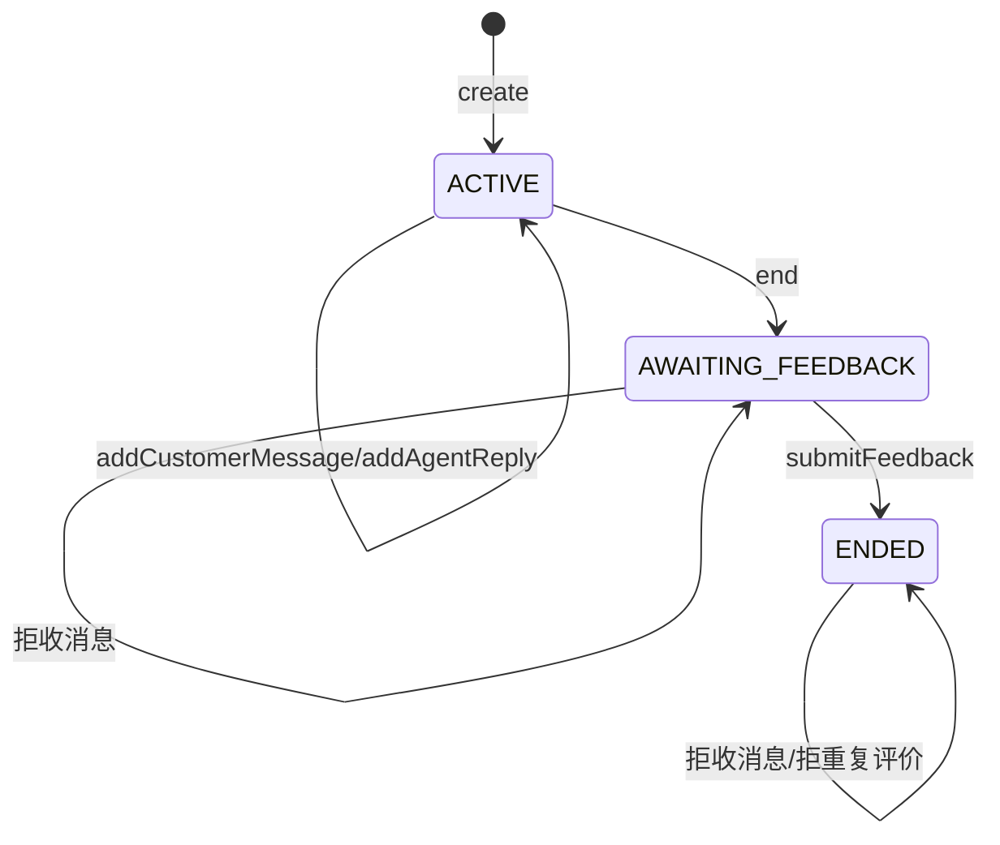
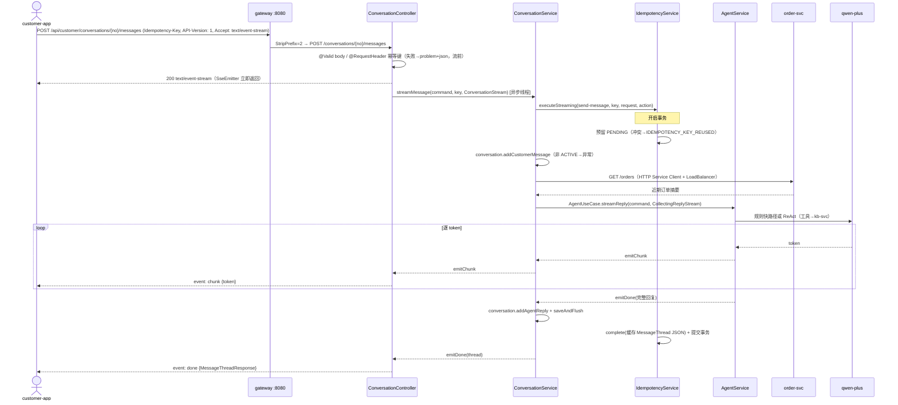
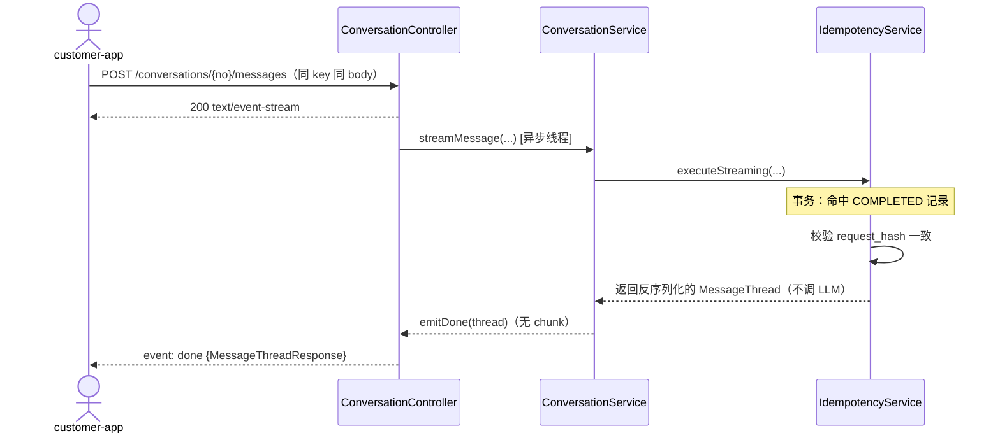

# Customer Agent 合并模块技术设计（customer-svc 并入 + SSE 流式）

## 1. 文档信息

- 模块：`customer-agent`（合并原 `customer-svc`）
- 日期：2026-08-30
- 状态：已确认（用户已批准合并方案 + 前端 SSE 流式改造）
- 前置文档：`2026-08-29-customer-service.md`（已取代）、`2026-08-29-customer-agent.md`（已取代）
- 目标：将 `customer-svc` 的全部业务能力（会话生命周期、消息、评价、快捷问题、幂等）迁入 `customer-agent`，删除独立业务服务；会话服务直接调用进程内 `AgentUseCase`；消息发送端点升级为 SSE 流式，前端同步改造
- 技术基础：Spring Boot 4.1.1、Spring AI 2.0.x、Spring MVC（SseEmitter）、Spring Data JPA、Flyway、PostgreSQL、React + Vite（fetch 流式解析）

## 2. 已确认的业务与技术决策

1. `customer-svc` 模块整体删除，功能迁入 `customer-agent`（包根 `org.acm.ca`，端口 8010，Eureka 注册名不变）。合并后它是「客服服务（业务 + AI Agent）」，架构分层图中业务层与 AI 应用层在该模块内合并。
2. 对外业务契约保持兼容：网关继续暴露 `/api/customer/**`；合并后服务以同路径提供 `/conversations`、`/quick-questions`。`API-Version: 1`、`Idempotency-Key`、Problem Details 约定保留。唯一契约变更：`POST /conversations/{conversationNo}/messages` 从同步 JSON 改为 SSE 流式（决策 7）。
3. 删除 `AiAgentClient` 出站端口与 `InProcessAiAgentClient`。`ConversationService` 直接调用同进程 `AgentUseCase.streamReply`，只保留一次命令模型转换。
4. 删除 `MockAiAgentClient`、`MockOrderQueryClient`、Mock 适配器选择代码及失败注入端点。`application.yml` 不在本次变更范围，遗留的 `customer.adapters.ai-agent` 键不再参与运行时选择。测试通过 `@Primary` 测试 Bean 隔离外部依赖。
5. `OrderQueryClient` 使用 Spring HTTP Service Client 真实调用 `order-svc`。HTTP 分组名即 Eureka 服务名，Spring Cloud LoadBalancer 负责解析；连接与读取超时由 Java 配置显式设置，不修改 `application.yml`。
6. 网关收敛为单路由：`Path=/api/customer/**,/api/agent/**` → `lb://customer-agent`（StripPrefix=2），删除 `customer-svc` 路由。agent 独立 SSE 端点从 `/api/agent/reply` 改为 `/agent/reply`，修正其经网关 404 的既有问题。
7. 消息发送端点改为 SSE 流式：`POST /conversations/{conversationNo}/messages` 返回 `text/event-stream`。同步版本删除（前端是唯一消费者）。事件协议：`chunk`（原始 token 文本）、`done`（`MessageThreadResponse` JSON，最后一个事件，含持久化后的客户消息与 agent 回复）、`error`（`{code, detail}` JSON，最后一个事件）。
8. SSE 错误分级：请求级错误（body 校验失败、缺 `Idempotency-Key`、`Accept` 不兼容）在流建立前返回 problem+json（400/406）；一旦流建立，所有业务与外部依赖错误一律以 `error` 事件 in-band 推送（含会话不存在/已结束、幂等冲突）。
9. 流式幂等：`streamMessage` 复用 `IdempotencyService.execute` 的单事务骨架（预留 PENDING → 存客户消息 → LLM 流式（chunk 透传）→ 存 agent 回复 → complete 缓存 `MessageThread`），闭包捕获业务流回调；重放路径不执行 action，无 chunk。同 key 不同 body 或并发写 → `error` 事件 `IDEMPOTENCY_KEY_REUSED`。action 失败整体回滚（含 PENDING 行），同 key 可重试。
10. `API-Version` 校验统一：`ApiVersionInterceptor` 覆盖 `/conversations/**`、`/quick-questions/**`、`/agent/**`（前端每请求均携带该头，无破坏）；`/mock/**` 不校验。
11. 前端 `customer-app` 流式改造：发送消息改用 fetch + `ReadableStream` 手工解析 SSE（`EventSource` 不支持 POST），`chunk` 逐段追加到「正在输入」气泡，`done` 用权威 `MessageThread` 整体替换，`error` 展示错误并回滚乐观消息。会话创建/结束/评价/快捷问题拉取仍为同步 JSON。
12. 不实现：前端流式之外的推送通道（WebSocket）、租户隔离与鉴权。数据库名 `cs`、端口、既有表结构不变。

## 3. 目标与非目标

### 3.1 目标

- 单服务承载完整客服链路：会话状态机 + 幂等 + 持久化 + 规则路由/ReAct 生成。
- 真实 agent 成为默认回复生成实现（消除「agent 服务无调用方」的悬空状态）。
- 首字延迟优化：LLM token 逐段透传到浏览器，替代「正在输入」全量等待。
- 快捷问题本地化，消除跨服务环依赖与 resilience4j/eureka 客户端调用的维护面。
- 网关路由符合 `/api/{service}/**` + StripPrefix=2 全仓约定。

### 3.2 非目标

- 不做多轮记忆迁移（仍由本服务持久化 + `recentMessages` 注入）、不做 Reflection/意图识别（沿用混合范式设计）。
- 不改事务边界（单事务含 LLM 调用的连接占用问题记入 tech_debt，见 §13）。
- 不做 order-svc 鉴权（沿用演示环境约束）。

## 4. 用例清单

### UC-01 创建会话（同步）

```gherkin
Given 客户提交合法的客户标识与幂等键
When 客户创建会话
Then 系统生成唯一会话编号并返回会话详情（状态 ACTIVE）
```

### UC-02 流式发送消息（首次，规则命中或 ReAct）

```gherkin
Given 会话状态为 ACTIVE
And 客户提交非空消息内容与未使用的幂等键
When 客户发送消息（Accept: text/event-stream）
Then 系统在事务内预留幂等记录并保存 CUSTOMER 消息
And 系统从 order-svc 获取近期订单上下文并调用 AgentUseCase 流式生成
And 每个 LLM token 以 chunk 事件透传给前端
And 流结束后系统保存 AGENT 回复、完成幂等记录并提交事务
And 系统以 done 事件返回持久化后的 MessageThread（含消息 id/seqNo/createdAt）
```

### UC-03 幂等重放

```gherkin
Given 同一幂等键与相同请求体已存在 COMPLETED 记录
When 客户再次发送消息
Then 系统不调用 LLM、不产生 chunk 事件
And 系统直接以 done 事件返回缓存的 MessageThread
```

### UC-04 流中失败与重试

```gherkin
Given LLM 调用失败或返回空内容
When 流式发送消息
Then 系统推送 error 事件（LLM_UNAVAILABLE）
And 事务整体回滚（客户消息与幂等预留均不落库）
And 同一幂等键重试可成功
```

### UC-05 幂等键冲突

```gherkin
Given 幂等键已存在但请求体不同
When 客户发送消息
Then 系统推送 error 事件（IDEMPOTENCY_KEY_REUSED）
Given 幂等键已被并发请求预留
When 客户发送消息
Then 系统推送 error 事件（IDEMPOTENCY_KEY_REUSED）
```

### UC-06 会话状态冲突（流中）

```gherkin
Given 会话不存在或状态为 AWAITING_FEEDBACK / ENDED
When 客户发送消息
Then 系统推送 error 事件（CONVERSATION_NOT_FOUND / CONVERSATION_NOT_ACTIVE）
And 不产生任何持久化副作用
```

### UC-07 空消息（流前拒绝）

```gherkin
Given 消息内容为空或仅空白字符
When 客户发送消息
Then 流建立前返回 400 problem+json（VALIDATION_FAILED）
And 不建立 SSE 流、不调用 LLM
```

### UC-08 快捷问题

```gherkin
Given 客户请求快捷问题列表
When 前端 GET /quick-questions
Then 系统从本地数据库返回启用的快捷问题
When 客户选择某快捷问题发送
Then 等价于 UC-02 的流式发送
```

### UC-09 agent 独立 SSE 入口

```gherkin
Given 调用方直连服务或经网关访问 /api/agent/reply
When 携带 API-Version: 1 与对话上下文请求 POST /agent/reply
Then 系统按原混合范式协议返回 chunk/done/error 事件流（不经幂等、不落库）
```

### UC-10 结束会话与评价（同步）

```gherkin
Given 会话状态为 ACTIVE
When 客户结束会话
Then 会话进入 AWAITING_FEEDBACK 且返回 202
When 客户提交满意度评价
Then 会话进入 ENDED；重复提交返回 409 FEEDBACK_ALREADY_SUBMITTED
```

## 5. 模块边界

### 5.1 调用方

| 调用方 | 使用能力 |
| --- | --- |
| `customer-app`（经网关 `/api/customer/**`） | 会话 CRUD、流式发消息、快捷问题 |
| 任意直连/经网关 `/api/agent/**` 调用方 | agent 独立 SSE 回复生成（无业务语义） |

### 5.2 输入/输出

- 入站：REST 同步 JSON（创建/查询/结束/评价/快捷问题）+ SSE 流式（发消息、agent reply）。
- 出站端口：`OrderQueryClient`（HTTP → order-svc）、`KbSearchClient`（HTTP → kb-svc，ReAct 路径工具）。进程内 agent 通过 `AgentUseCase` 入站端口直接调用。

### 5.3 不改的范围

- `kb-svc`、`order-svc`、`registry-svc` 的职责与 API。
- 混合范式内核（`AgentService`/`RuleRouter`/`KbSearchTool`/`ToolCallObservingAdvisor`）。
- 既有表结构与 Flyway 迁移内容（原样复制到本模块）。
- 前端路由、页面结构与 `/api/customer` 基础路径。

## 6. 数据模型

沿用 customer-svc 既有 schema（V1/V2 迁移原样迁移）：

```mermaid
erDiagram
    conversations ||--o{ messages : "1:N"
    conversations ||--o| feedback : "1:1"
    conversations {
        bigint id PK
        string conversation_no UK "CONyyMMddHHmmss######"
        string customer_id
        string status "ACTIVE|AWAITING_FEEDBACK|ENDED"
        timestamp started_at
        timestamp ended_at
        bigint version "乐观锁"
    }
    messages {
        bigint id PK
        bigint conversation_id FK
        int seq_no "会话内唯一"
        string role "CUSTOMER|AGENT"
        text content
    }
    feedback {
        bigint id PK
        bigint conversation_id FK UK
        string rating "SATISFIED|DISSATISFIED"
        string comment "≤500"
    }
    quick_questions {
        bigint id PK
        int sort_order
        string question_text
        boolean enabled
    }
    idempotency_records {
        bigint id PK
        string operation UK "operation+key 复合唯一"
        string idempotency_key UK
        string request_hash "SHA-256"
        text response_body
        string status "PENDING|COMPLETED"
    }
```

## 7. 状态机



## 8. 核心流程

### 8.1 流式发送消息（首次）



### 8.2 幂等重放



### 8.3 关键伪代码

```text
// ConversationService.streamMessage —— 幂等流式（复用 execute 单事务骨架）
function streamMessage(command, key, ConversationStream out):
    agentStream = new ForwardingAgentStream(out)
        // emitChunk → out.emitChunk（透传）
        // emitDone(content) → 捕获全文
        // emitError(code, detail) → throw AiAgentUnavailableException(code: detail)
    thread = idempotencyService.execute(send-message, key, request, MessageThread.class,
        action: () -> {
            conversation = loadByNo(command.conversationNo)           // 不存在→ConversationNotFoundException
            conversation.addCustomerMessage(command.content)           // 非 ACTIVE→ConversationNotActiveException
            saveAndFlush()
            orders = orderQueryClient.getRecentOrders(customerId)
            agentUseCase.streamReply(buildGenerateReplyCommand(...), agentStream)
            conversation.addAgentReply(agentStream.fullContent())      // 空内容→AiAgentUnavailableException
            saveAndFlush()
            return toThread(conversation)
        })
    out.emitDone(thread)   // 事务提交后发送 done（重放路径同样直达此处）
```

## 9. API 设计

所有业务端点要求 `API-Version: 1`（拦截器）。写操作携带 `Idempotency-Key`。

### 9.1 同步端点（不变）

| 方法 | 路径 | 用途 | 成功响应 |
| --- | --- | --- | --- |
| `POST` | `/conversations` | 创建会话 | `201 ConversationDetailResponse` |
| `GET` | `/conversations` | 搜索会话 | `200 PageResponse<ConversationSummaryResponse>` |
| `GET` | `/conversations/{conversationNo}` | 会话详情（含消息与评价） | `200 ConversationDetailResponse` |
| `POST` | `/conversations/{conversationNo}/end` | 结束会话 | `202 ConversationDetailResponse`（AWAITING_FEEDBACK） |
| `POST` | `/conversations/{conversationNo}/feedback` | 提交评价 | `200 ConversationDetailResponse`（ENDED） |
| `GET` | `/quick-questions` | 快捷问题列表 | `200 List<QuickQuestionResponse>` |
| `POST` | `/agent/reply` | agent 独立 SSE 入口（原 `/api/agent/reply` 迁移） | `200 text/event-stream` |

### 9.2 流式端点（契约变更）

| 方法 | 路径 | 请求 | 成功响应 |
| --- | --- | --- | --- |
| `POST` | `/conversations/{conversationNo}/messages` | body `{content}` + `Idempotency-Key` + `Accept: text/event-stream` | `200 text/event-stream` |

SSE 事件流示例：

```text
event: chunk
data: 您

event: chunk
data: 好的

event: done
data: {"conversationNo":"C202608300001","messages":[{"id":1,"seqNo":1,"role":"CUSTOMER","content":"...","createdAt":"..."},{"id":2,"seqNo":2,"role":"AGENT","content":"...","createdAt":"..."}]}
```

- `chunk`：data 为原始 token 文本（含换行时按 SSE 规范拆多行 data，解析端以 `\n` 连接）。
- `done`：data 为 `MessageThreadResponse` JSON，与原同步响应同构；重放路径仅含此事件。
- `error`：data 为 `{"code","detail"}` JSON；事件后流关闭。

### 9.3 错误处理

| 场景 | 传输方式 | code |
| --- | --- | --- |
| body 校验失败 / 消息为空 | 流前 `400` problem+json | `VALIDATION_FAILED` |
| 缺 `Idempotency-Key` | 流前 `400` problem+json | `MISSING_REQUEST_HEADER` |
| `Accept` 与 event-stream 不兼容 | 流前 `406`（Spring 内容协商） | — |
| 会话不存在 / 非 ACTIVE / 幂等冲突 | 流中 `error` 事件 | `CONVERSATION_NOT_FOUND` / `CONVERSATION_NOT_ACTIVE` / `IDEMPOTENCY_KEY_REUSED` |
| LLM 失败、订单上下文失败 | 流中 `error` 事件 | `LLM_UNAVAILABLE` / `EXTERNAL_DEPENDENCY_FAILED` |

## 10. 应用结构

```text
org.acm.ca
├── domain
│   ├── conversation/        # 迁入：Conversation/Message/Feedback/状态机/仓库/异常
│   ├── quickquestion/       # 迁入：QuickQuestion + 仓库
│   └── shared/              # 合并：BusinessException/InvalidRequestException/AuditMetadata（单份）
├── application
│   ├── port/in
│   │   ├── AgentUseCase / GenerateReplyCommand / ReplyStream      # 现有
│   │   └── ConversationUseCase / commands / queries / ConversationStream  # 迁入 + 新流式回调
│   ├── port/out
│   │   ├── OrderQueryClient     # HTTP → order-svc
│   │   └── KbSearchClient       # 现有
│   ├── service
│   │   ├── AgentService         # 现有（混合范式内核）
│   │   ├── ConversationService  # 迁入 + streamMessage 变体
│   │   ├── IdempotencyService   # 迁入；streamMessage 复用 execute 单事务骨架
│   ├── idempotency/             # 迁入：IdempotencyRecord + 仓库
│   └── rule/                    # 现有：ReplyRule/ReplyRulesConfig/RuleRouter
├── infra
│   ├── AuditingConfig           # 迁入
│   ├── SseExecutorConfig        # 现有 agentExecutor 迁出为共享池
│   ├── client/                  # OrderServiceHttpClient/OrderQueryClientImpl + KbSearchClientImpl
│   ├── llm/                     # 现有：ChatClientConfig/KbSearchTool
│   └── observability/           # 现有：ToolCallObservingAdvisor
└── interfaces/http
    ├── controller/              # ConversationController(流式)/QuickQuestionController(本地)/AgentController(/agent/reply)/MockController
    ├── SseReplyStream           # agent 端适配（现有）
    ├── ConversationSseStream    # 业务端适配（新）
    ├── mapper/ request/ response/  # 迁入
    ├── ApiVersionInterceptor    # 路径扩大
    └── GlobalExceptionHandler   # 两模块错误码映射并集
```

## 11. 技术决策

1. **进程内 agent 调用**：`ConversationService` 直接依赖 `AgentUseCase`，不为同模块调用增加出站端口与透传适配器。
2. **订单 HTTP 调用**：`@ImportHttpServices(group = "order-svc")` 注册声明式客户端；分组名由 LoadBalancer 解析为 Eureka 实例，Java 配置显式设置 2s 连接超时与 5s 读取超时。
3. **事务与流式**：`executeStreaming` 沿用 `execute` 的单事务骨架（`@Transactional` 即边界），action 携带业务流回调；chunk 网络写发生在事务内（已评估，见 §13）。
4. **SseEmitter 超时**：业务流式端点 60s（ReAct 多轮 + LLM 30s + 持久化余量）；agent 端点维持 30s。
5. **网关**：单路由多 Path 谓词，StripPrefix=2；`GatewayRoutesTest` 断言 3 条路由（order-svc/kb-svc/customer-agent）。
6. **前端 SSE 解析**：fetch + ReadableStream 手工解析（`event:`/`data:`/空行分帧、多 data 行 `\n` 连接、CRLF 兼容）；流前 problem+json 走既有 `CustomerServiceError` 映射；`error` 事件构造 `CustomerServiceError(code, detail, 200)`。
7. **依赖增删**：+ data-jpa/flyway/postgresql/common-lib/integrationTest+Testcontainers/jacoco 合并报告、spring-boot-http-client；− resilience4j、aspectjweaver。

## 12. 一致性与失败处理

- 幂等语义与迁移前一致：PENDING 预留防并发写、request_hash 防键复用、COMPLETED 缓存重放、失败回滚释放键。
- 流式下的最终一致：chunk 已发送但事务回滚时，前端收到 `error` 事件后丢弃乐观内容；done 只在事务提交后发送，前端以 done 内容为权威状态。
- 失败不伪造：LLM 空/失败走 `error` 事件（与 agent 端 `LLM_UNAVAILABLE` 约定一致），不回退模板文案。

## 13. 已知代价（记入 tech_debt）

- 单事务内同步等待 LLM（最长 ~30s）：DB 连接占用 + chunk 网络写在事务内。演示可接受；演进方向为拆分预留/提交两段事务 + 状态机补偿。
- 前端直连 SSE 经 vite proxy 与 Spring Cloud Gateway 转发，均为流式透传，无缓冲问题；若未来引入响应缓冲层（如部分 CDN/网关插件）需确认 `X-Accel-Buffering` 等配置。

## 14. 演进路径

1. 前端体验：发送中断（AbortController）、打字机节流渲染、失败自动重试按钮。
2. token 用量：done 事件附带 usage（沿用 2026-08-29 文档 §12.4），由本服务持久化成本数据（tech_debt 已有条目，消费方从 customer-svc 变为本服务）。
3. 事务拆分：消息先落库 + agent 回复异步补偿，替换单事务长连接。
